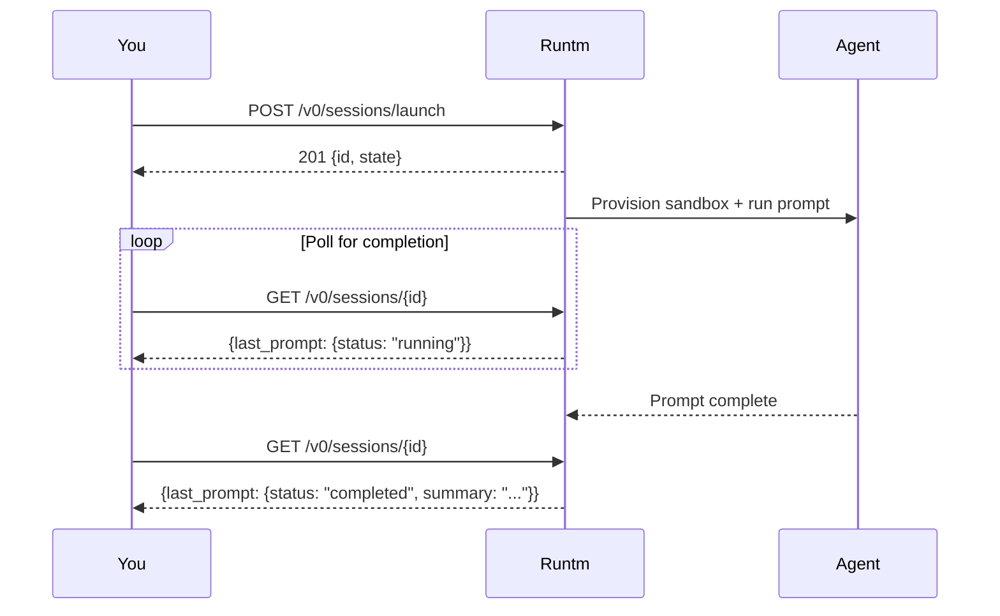

Launch a background agent: creates a sandbox session **and** fires a prompt in a single call. The endpoint returns immediately with a session ID while the agent works in the background.

This is the recommended way to run autonomous coding tasks via the API.

## How it works



## Request Body

<ParamField body="prompt" type="string" required>
  The task or prompt for the agent (1–100,000 characters)
</ParamField>

<ParamField body="agent" type="string" default="claude-code">
  Coding agent to use: `claude-code`, `codex`, `github-copilot`, or `opencode`
</ParamField>

<ParamField body="template" type="string">
  Project template: `web-app`, `backend-service`, `static-site`, or `docker`
</ParamField>

<ParamField body="model" type="string">
  Model to use: `sonnet` (default), `opus`, `haiku`, or `opusplan`
</ParamField>

<ParamField body="on_complete" type="string" default="pause">
  Lifecycle action when the prompt finishes: `pause` (default — sandbox pauses to save resources), `destroy` (sandbox is deleted), or `keep_alive` (sandbox stays running)
</ParamField>

<ParamField body="ttl_minutes" type="integer" default="60">
  Maximum session lifetime in minutes (1–1440). Session is destroyed after this regardless of prompt status.
</ParamField>

<ParamField body="mode" type="string" default="autopilot">
  Session mode: `autopilot` or `interactive`
</ParamField>

<ParamField body="plan_mode" type="boolean" default="false">
  When `true`, the agent analyzes without making changes. Useful for code review or architecture analysis. Defaults `on_complete` to `keep_alive`.
</ParamField>

<ParamField body="prompt_timeout_minutes" type="integer" default="15">
  Maximum minutes for the prompt execution before timeout (1–120)
</ParamField>

<ParamField body="github_repo" type="object">
  GitHub repository metadata: `{"full_name": "owner/repo", "size_kb": 1024}`
</ParamField>

## Response

<ResponseField name="id" type="string">
  Session ID — use this to poll for status via `GET /v0/sessions/{id}`
</ResponseField>

<ResponseField name="state" type="string">
  Initial state (typically `provisioning`)
</ResponseField>

<ResponseField name="message" type="string">
  Confirmation message with polling instructions
</ResponseField>

## Polling for completion

After launching, poll `GET /v0/sessions/{id}` and check the `last_prompt.status` field:

| Status | Meaning |
|--------|---------|
| `running` | Agent is working on the prompt |
| `completed` | Prompt finished successfully |
| `error` | Prompt failed — check `last_prompt.error` |
| `timed_out` | Prompt exceeded `prompt_timeout_minutes` |

<RequestExample>
```bash cURL
# Launch a background agent
curl -X POST "https://app.runtm.com/api/v0/sessions/launch" \
  -H "Authorization: Bearer runtm_xxx" \
  -H "Content-Type: application/json" \
  -d '{
    "prompt": "Build a REST API with FastAPI that has CRUD endpoints for a todo list with SQLite storage",
    "agent": "claude-code",
    "template": "backend-service",
    "on_complete": "pause",
    "ttl_minutes": 30
  }'

# Poll for completion
curl -H "Authorization: Bearer runtm_xxx" \
  "https://app.runtm.com/api/v0/sessions/a1b2c3d4-e5f6-7890-abcd-ef1234567890"
```

```python Python
import requests
import time

# Launch
response = requests.post(
    "https://app.runtm.com/api/v0/sessions/launch",
    headers={"Authorization": "Bearer runtm_xxx"},
    json={
        "prompt": "Build a REST API with FastAPI that has CRUD endpoints for a todo list with SQLite storage",
        "agent": "claude-code",
        "template": "backend-service",
        "on_complete": "pause",
        "ttl_minutes": 30,
    },
)

session_id = response.json()["id"]
print(f"Agent launched: {session_id}")

# Poll until done
while True:
    status = requests.get(
        f"https://app.runtm.com/api/v0/sessions/{session_id}",
        headers={"Authorization": "Bearer runtm_xxx"},
    ).json()

    prompt_status = (status.get("last_prompt") or {}).get("status", "idle")
    print(f"Status: {prompt_status}")

    if prompt_status in ("completed", "error", "timed_out"):
        break

    time.sleep(5)

print(f"Result: {status['last_prompt'].get('summary', 'No summary')}")
print(f"Cost: ${status['total_cost_usd']:.4f}")
```

```javascript JavaScript
const launch = await fetch(
  "https://app.runtm.com/api/v0/sessions/launch",
  {
    method: "POST",
    headers: {
      "Authorization": "Bearer runtm_xxx",
      "Content-Type": "application/json",
    },
    body: JSON.stringify({
      prompt: "Build a REST API with FastAPI that has CRUD endpoints for a todo list with SQLite storage",
      agent: "claude-code",
      template: "backend-service",
      on_complete: "pause",
      ttl_minutes: 30,
    }),
  }
);

const { id } = await launch.json();
console.log(`Agent launched: ${id}`);

// Poll until done
let done = false;
while (!done) {
  const res = await fetch(
    `https://app.runtm.com/api/v0/sessions/${id}`,
    { headers: { "Authorization": "Bearer runtm_xxx" } }
  );
  const status = await res.json();
  const promptStatus = status.last_prompt?.status ?? "idle";
  console.log(`Status: ${promptStatus}`);

  if (["completed", "error", "timed_out"].includes(promptStatus)) {
    console.log(`Result: ${status.last_prompt?.summary}`);
    done = true;
  } else {
    await new Promise(r => setTimeout(r, 5000));
  }
}
```
</RequestExample>

<ResponseExample>
```json 201
{
  "id": "a1b2c3d4-e5f6-7890-abcd-ef1234567890",
  "state": "provisioning",
  "message": "Agent launched. Poll GET /api/v0/sessions/{id} for status."
}
```

```json 400
{
  "detail": "Invalid agent: gpt-4. Must be one of: claude-code, codex, github-copilot, opencode"
}
```

```json 400
{
  "detail": "Session limit exceeded. Destroy existing sessions before creating new ones."
}
```
</ResponseExample>
