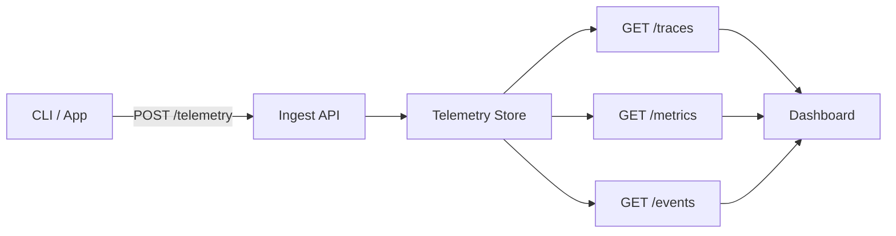

The Telemetry API lets you ingest and query observability data from your Runtm deployments. Track request flows with distributed traces, monitor performance with metrics, and capture significant occurrences with events.

## Concepts

| Concept | Description | Use Case |
|---------|-------------|----------|
| **Traces** | Distributed traces with spans showing request flow | Debug slow requests, understand call chains |
| **Metrics** | Numeric measurements (counters, gauges) | Monitor throughput, error rates, latency |
| **Events** | Timestamped occurrences with metadata | Track deploys, errors, configuration changes |

## Authentication

All telemetry endpoints use Bearer token authentication:

```bash
curl -H "Authorization: Bearer runtm_xxx" https://app.runtm.com/api/v0/telemetry/traces
```

## Required Scopes

| Operation | Required Scope |
|-----------|---------------|
| Ingest data (`POST`) | `deploy` |
| Query data (`GET`) | `read` |

## Endpoints

### Ingestion

| Method | Endpoint | Description |
|--------|----------|-------------|
| `POST` | `/v0/telemetry` | [Ingest batch](/api/telemetry/ingest) — send spans, events, and metrics |

### Queries

| Method | Endpoint | Description |
|--------|----------|-------------|
| `GET` | `/v0/telemetry/traces` | [List traces](/api/telemetry/traces) |
| `GET` | `/v0/telemetry/traces/{trace_id}` | [Get trace](/api/telemetry/traces) — single trace with all spans |
| `GET` | `/v0/telemetry/deployments/{id}/traces` | [Deployment traces](/api/telemetry/traces) — traces for a specific deployment |
| `GET` | `/v0/telemetry/metrics` | [List metrics](/api/telemetry/metrics) |
| `GET` | `/v0/telemetry/metrics/summary` | [Metrics summary](/api/telemetry/metrics) — aggregated dashboard view |
| `GET` | `/v0/telemetry/events` | [List events](/api/telemetry/events) |

## Data Flow



<Info>
Telemetry data is scoped to your account. You can only query data from your own deployments.
</Info>
