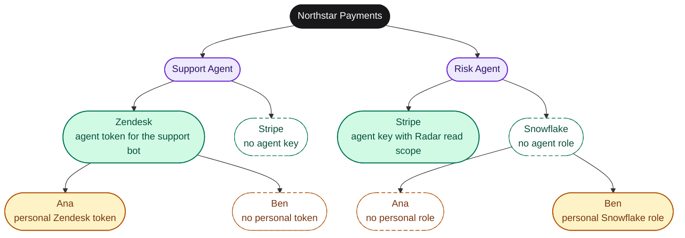

## Outcome

Your agent's template carries every credential, MCP server and repository the agent needs, and a session launched from it can reach those systems with the least access that still does the job. You know how to check that a tool made it into the snapshot instead of finding out mid-run.

## Decide

The agent never holds tools directly. It points at a template through `Default template`, and the template is the capability container: tool providers, MCP servers, secrets, repositories, and the context and guardrails covered on the neighbouring pages. Answer these before adding anything.

**Which systems must the agent read, and which must it never write?**

- Bad: "Give it our Stripe key and the production database URL."
- Good: "Stripe with a restricted key limited to read on charges, disputes and refunds. Postgres through the `support_readonly` role that can only see the `payments` schema views. Zendesk with an agent-level token. Nothing that can move money."

**Provider or MCP server?**

- A tool provider stores credentials and hands them to the sandbox as environment variables or files, optionally installing a CLI. The agent then uses the vendor's API, CLI or SDK like an engineer would. Choose this when the vendor has a good API or CLI and you want the agent to write its own queries.
- An MCP server exposes a fixed set of typed tools to the harness. Choose this when the vendor ships an MCP server you trust, or when you want to constrain the agent to a small tool surface.
- Bad: "Add both, the agent will figure it out."
- Good: "Stripe as a provider because the runbook uses the Stripe CLI for timeline reconstruction. Notion as an MCP server because we only want `search` and `read_page`."

**Who else in the org gets these credentials?**

- An org-scoped connection is available to every template whose skills ask for it. A personal connection is available only to sessions that user launches. An agent-scoped connection is available only when a session runs as that agent.
- Bad: "Org-scoped Snowflake with the analytics service account, we already have it."
- Good: "Agent-scoped Snowflake connection for the risk agent using a role that can read `fraud.alerts` and `fraud.attempts`."

## How tools reach a session

<Frame caption="Settings > Context > Tools & MCP lists tool providers and MCP servers side by side.">
  
</Frame>

Two mechanisms feed capabilities into a session, and they are attached differently.

| Capability | What it is | How it reaches a template | Where credentials live |
|---|---|---|---|
| Tool provider | A declarative provider: auth methods, fields, and how to materialize credentials as env vars, files or setup commands, plus optional packages installed with mise | A connection is created for the provider (org, personal or agent scope). A session receives it when an attached skill lists the provider slug in `requires.integrations`, or when the connection is agent-scoped for the agent running the session | On the connection, encrypted |
| MCP server | An `mcp_server_v0` directive: `stdio` (command, args, env) or `http` / `sse` (url, headers) | Attached to one or more templates, to a repo, or org-wide, like a skill | On a separate connection per MCP server, never inside the directive or the snapshot |
| Template secret | A name and encrypted value on the template | Injected into every session from the template | On the template, encrypted at rest |
| Repository | One primary repo plus optional linked repos cloned into the snapshot | Set at template creation; access comes from the org's GitHub App installation | GitHub App installation tokens minted per session |

The important consequence: connecting a tool provider does not by itself give any template access to it. The filter that decides which org or personal connections a session receives is the union of `requires.integrations` across the skills attached to that template. Agent-scoped connections are exempt because binding a connection to one agent is already the narrowest possible intent. If a template has no skill that requires a provider, the connection is silently left out.

### Definition, connection, attachment

Every integration is three separate objects, and only one of them ever holds a secret. Creating a definition attaches it nowhere, and attaching it grants no credentials.

| Object | What it is | Created with |
|---|---|---|
| **Definition** | The wiring: a tool provider (service, auth methods, package to install) or an MCP server (transport, command or URL). No secrets. | `New tool or MCP server` in the dashboard, or `tools providers create` / `mcp create` |
| **Connection** | Credentials supplied against a definition, encrypted, with a status and a scope (org-wide, agent, or personal). One definition, many connections. | `Add connection` on the tool or MCP server, or `tools create` for providers |
| **Attachment** | Where a skill or MCP server loads: a template, a repo, or every repo in the org. | `skills attach`, `mcp attach`, or the template's Context tab |

A coding agent setting up an integration should build the definition and the attachment, then hand the person to the dashboard to create the connection so the secret never passes through the agent.

{/* cli: runtm-api tools providers list */}
{/* cli: runtm-api tools providers create --slug <slug> --name "<Display name>" --category <category> --tagline "<one line>" --logo <https-url> --auth-methods '<json>' */}
{/* cli: runtm-api mcp attach <mcp_id> --template <template_id> */}

## Who the agent acts as: the credential hierarchy

Every connection, whether it belongs to a tool provider or to an MCP server, lives at exactly one of three scopes. Together they form a tree with the organization at the root.

| Scope | Who can use it | Typical credential |
|---|---|---|
| **Org-wide** | every session in the org whose template asks for the provider | a shared, least-privilege key: a restricted read-only Stripe key, a support mailbox token |
| **Agent** | only sessions that run as that roster agent | the agent's own identity: a Zendesk token for the bot user, a Stripe key with the scopes that one job needs |
| **Personal** | only sessions launched by, or on behalf of, that user | the person's own login, so their actions are attributed to them |



Each level has its own colour: the organization is black, agents are violet, tools are green, people are amber. Solid nodes hold a credential. Dashed nodes hold none. The root holds the org-wide connections: a restricted read-only Stripe key and a read-only Snowflake role. For a run of an agent that touches a tool, start at that agent's tool node: if it is solid, the agent credential is used; otherwise if the user's leaf under it is solid, the personal credential is used; otherwise the org-wide credential at the root is the floor.

### How a run picks a credential

When a session starts, Runtime resolves one connection per provider, walking the tree from the most specific scope outward:

1. **Agent.** If the run is attributed to a roster agent and that agent has its own connection for the provider, it wins. Agent connections are never used by runs that are not that agent's.
2. **Personal.** Otherwise, if the run's effective user has a personal connection for the provider, that is used.
3. **Org-wide.** Otherwise the org-wide connection is used.
4. **Unmet.** If none exists, the provider shows up as an unmet requirement in the session manifest and the run starts without it.

Two facts decide the outcome, and neither is "channel versus DM":

- **Which agent the run belongs to.** A Slack mention, a DM, an email, a Linear assignment or a cron tick all run as the agent behind that trigger. A session someone opens from the dashboard runs as no agent, so agent connections never apply to it.
- **Who the effective user is.** For Slack, Runtime matches the Slack user to a Runtime account by email; a match becomes the effective user. If there is no match, the trigger's service user is the effective user, and that account normally has no personal connections. Email, WhatsApp and SMS runs do not match the sender at all: their effective user is always the trigger's service user, so personal connections never apply to them and they fall to the agent connection or the org-wide one.

### The example, run through

Northstar has two agents. Support Agent's runbook requires `zendesk` and `stripe`; Risk Agent's requires `stripe` and `snowflake`.

| Run | Runs as | Effective user | First tool resolves to | Second tool resolves to |
|---|---|---|---|---|
| Ana mentions Support Agent in `#support` | Support Agent | Ana | Zendesk: **agent** token (wins over Ana's personal token) | Stripe: **org-wide** key (no agent key) |
| Ana DMs Risk Agent | Risk Agent | Ana | Stripe: **agent** Radar key | Snowflake: **org-wide** role (no agent role, Ana has no personal role) |
| Ben DMs Risk Agent | Risk Agent | Ben | Stripe: **agent** Radar key | Snowflake: **personal** role (Ben's own) |
| Ana opens a session from the Support template in the dashboard | no agent | Ana | Zendesk: **personal** token (agent credentials never apply) | Stripe: **org-wide** key |
| A Slack user with no Runtime account mentions Support Agent | Support Agent | the trigger's service user | Zendesk: **agent** token | Stripe: **org-wide** key |

Read the third row carefully: a person's own credential is used by an agent run when the agent has no connection of its own for that tool. If the agent must always act as itself, give it an agent connection for every provider it touches. Read the last row the same way: the org-wide credential is the floor everyone falls back to, so it should be the least privileged one in the tree.

### Where each scope is set

- **Org-wide and personal**: **Settings > Context > Tools & MCP**, connect the provider and pick **Teams** or **Personal**. Personal connections are visible only to their owner.
  {/* cli: runtm-api tools create --provider <slug> --auth-method <method_id> --scope org --credentials '{"<field_id>":"<value>"}' */}
  {/* cli: runtm-api tools create --provider <slug> --auth-method <method_id> --scope personal --credentials '{"<field_id>":"<value>"}' */}
- **Agent**: in the same connect dialog choose the agent scope and pick the roster agent. Agent connections show the agent's avatar on the connection row. The CLI creates only org and personal connections today; agent scope is set in the dashboard or with `scope: "agent"` and `agent_id` on `POST /api/cloud/knowledge/integrations`.
  {/* cli-verify: runtm-api tools list --provider <slug> --scope org */}
- **MCP servers** follow the same three scopes on their connection rows, with the same agent, then personal, then org order.

Agent connections are the one scope exempt from the skill filter: they reach the agent's sessions whether or not an attached skill lists the provider in `requires.integrations`. Org-wide and personal connections still need a skill to ask for them.

## Do it

### Connect a tool provider

<Steps>
  <Step title="Open the catalog">
    Go to **Settings > Context > Tools & MCP** and click **New tool or MCP server**. The chooser asks **What do you want to add?** Pick **Tool** for a provider or **MCP server** for MCP.

    <Frame caption="Tools and MCP servers are configured differently, so the chooser separates them.">
      
    </Frame>
    {/* cli: runtm-api tools providers list */}
  </Step>
  <Step title="Pick a provider from the catalog">
    **Add a provider** lists the built-in providers your org has not added yet: BigQuery, Datadog, Google Cloud, Notion, Phone, PostHog, Slack, Trigify and Zendesk. Pick one and click through to the credentials form.

    <Frame caption="The catalog. You fill in credentials after picking.">
      
    </Frame>

    If the vendor is not in the catalog, create a custom provider instead (next section) and it appears here for everyone in the org.
    {/* cli: runtm-api tools providers get <provider_id> */}
  </Step>
  <Step title="Enter credentials">
    Fill in the provider's auth method. Static methods take the fields the provider declares (an API key, a token and email, a service account file). OAuth methods open the vendor's consent screen. Pick the scope: **Personal** or **Teams**.

    Use the least privileged credential the vendor offers. For Stripe that is a restricted key with read permissions only. For Postgres it is a dedicated read-only role. The agent never needs write access to investigate.
    {/* cli: runtm-api tools create --provider <slug> --auth-method <method_id> --scope org --display-name "<name>" --credentials '{"<field_id>":"<value>"}' */}
    {/* cli-verify: runtm-api tools list --provider <slug> */}
  </Step>
  <Step title="Make a skill require it">
    Open the skill your agent uses (see [Skills and runbooks](/build/how-it-works/skills)) and declare the provider slug under `requires.integrations`. Without this the connection is never materialized for the template, unless the connection is agent-scoped.
    {/* cli: runtm-api skills update <skill_id> --content '{"entry_md":"SKILL.md","files":[...],"requires":{"integrations":["<slug>"]}}' */}
  </Step>
</Steps>

### Create a custom provider

Anything outside the catalog becomes a custom provider. Stripe, Postgres, Snowflake, Intercom, HubSpot, Jira, Sentry, Grafana, MySQL, MongoDB and Airtable have ready-made static schemas that the onboarding flow creates for you when you pick them during **Set Up Your First Agent**. For other vendors, or when you skipped onboarding, define the provider yourself.

<Steps>
  <Step title="Describe the provider">
    In **Tools & MCP**, choose **Tool**, then skip the catalog and define a custom provider. Give it a display name, a category (documents, data, observability, project management, CRM, support, messaging, meetings, sales or custom), a description and a logo URL (`--logo` on the CLI; the dashboard card is blank without one).
    {/* cli: runtm-api tools providers create --slug <slug> --name "<Display name>" --category <category> --tagline "<one line>" --auth-methods '<json>' */}
  </Step>
  <Step title="Declare the auth method and fields">
    Add one auth method. Kind `static` takes user-facing fields (`string`, `secret`, `multiline`, `file_contents`) and a materialization that maps them to environment variables, files or setup commands. Kind `oauth` takes authorize and token URLs. Kind `browser` takes a login URL for a browser-auth flow.

    A minimal static Stripe provider:

    ```json
    {
      "auth_methods": [
        {
          "id": "api_credentials",
          "display_name": "Secret key",
          "kind": "static",
          "fields": [
            {"id": "secret_key", "label": "Secret key", "kind": "secret", "required": true}
          ],
          "materialization": {"env": {"STRIPE_SECRET_KEY": "{fields.secret_key}"}}
        }
      ]
    }
    ```
    {/* cli: runtm-api tools providers create --slug stripe --name Stripe --category sales --package stripe=github:stripe/stripe-cli --auth-methods '[{"id":"api_credentials","display_name":"Secret key","kind":"static","fields":[{"id":"secret_key","label":"Secret key","kind":"secret","required":true}],"materialization":{"env":{"STRIPE_SECRET_KEY":"{fields.secret_key}"}}}]' */}
  </Step>
  <Step title="Optionally install a CLI">
    Add binary dependencies to have mise install the vendor CLI into the snapshot. Specs are `latest`, `npm:pkg`, `github:owner/repo`, `cargo:crate` or `ubi:owner/repo`.
    {/* cli: runtm-api tools providers update <provider_id> --package <name>=<spec> */}
  </Step>
  <Step title="Connect it">
    The provider now appears in **Add a provider**. Connect it with credentials exactly like a built-in one, then require it from a skill.
    {/* cli: runtm-api tools create --provider <slug> --auth-method api_credentials --scope org --credentials '{"secret_key":"<value>"}' */}
  </Step>
</Steps>

### Add an MCP server

<Steps>
  <Step title="Define the server">
    In **Tools & MCP**, choose **MCP server**. For a local server give a command, ordered arguments and environment variables. For a remote server give the URL and headers, with transport `http` or `sse`. The definition is written verbatim into the harness's MCP configuration at session start.
    {/* cli: runtm-api mcp create --name <slug> --display-name "<Name>" --transport stdio --command npx --arg -y --arg <package> */}
    {/* cli: runtm-api mcp create --name <slug> --display-name "<Name>" --transport http --url https://<host>/mcp */}
  </Step>
  <Step title="Add a connection for its credentials">
    Open the server and add a connection. Static kinds are `api_token`, `headers` and `env`. For servers that publish OAuth metadata, use the OAuth flow and the platform discovers the endpoints. Scope the connection to the org, yourself, or one agent. Credentials on a connection are injected at session start and never baked into the template snapshot. Connections are managed in the dashboard and through the `/api/agent-directives/{id}/connections` endpoints; the CLI does not create them today.
  </Step>
  <Step title="Attach it to the template">
    Attach the server to the agent's template, to a repo, or org-wide. Then rebuild the template.
    {/* cli: runtm-api mcp attach <mcp_id> --template <template_id> */}
    {/* cli-verify: runtm-api template mcp <template_id> */}
  </Step>
</Steps>

### Add template secrets

<Frame caption="The template Secrets tab. Values are encrypted at rest and injected into every session.">
  
</Frame>

<Steps>
  <Step title="Open the template's Secrets tab">
    Go to **Templates**, open the agent's template and pick **Secrets**. This tab is admin-only: **Secrets are admin-only**. Members never see the values.
    {/* cli: runtm-api template secrets list <template_id> */}
  </Step>
  <Step title="Add variables the environment needs">
    Add names and values, or paste a `.env`. Prefer provider connections for anything that identifies a vendor account, and keep template secrets for build-time and environment configuration such as private registry tokens or a base URL.
    {/* cli: runtm-api template secrets set <template_id> <NAME> <value> */}
  </Step>
</Steps>

### Attach repositories

<Frame caption="A template's Overview: repository and branch, working directory, owning group, services, coding agents and sandbox tier.">
  
</Frame>

<Frame caption="The template Context tab. Skills, MCP, Docs and Knowledge are inherited from the org and marked Enforced by org.">
  
</Frame>

A template is created **From a repository** or as a **Blank environment**. Repository access comes from the org's GitHub App installation, so install the app on the repos first under **Settings > Integrations > GitHub**. Linked repos are cloned alongside the primary repo. Repo-scoped skill and MCP attachments follow the repo into any template that includes it.

{/* cli: runtm-api github installations */}
{/* cli: runtm-api template create --display-name "<Name>" --github-repo <owner/repo> --github-branch main --tier basic */}

### Build

Every attachment above lands in the snapshot only at build time. After attaching, build once, and rebuild whenever `attachments_changed_since_build` is true.

{/* cli: runtm-api template build <template_id> */}
{/* cli-verify: runtm-api template get <template_id> | jq '{build_status, attachments_changed_since_build, skills: [.skills[].name], mcp: [.mcp_servers[].name]}' */}

## Verify

1. **The tool is connected.** Under **Tools & MCP** the provider shows as connected with a healthy status rather than an error.
2. **The template knows about it.** The template detail lists the attached skills and MCP servers, and the skill that requires the provider is among them.
3. **The build is current.** The template build status is `ready` and it is not flagged as changed since the last build.
4. **A session sees it.** Launch a session from the template and run `env | grep <VAR>` in the terminal, or `runtm-api session exec <session_id> --json -- env`. For an MCP server, ask the harness to list its tools.

If step 4 fails while steps 1 to 3 pass, the connection was filtered out. Check that an attached skill requires the provider slug, or scope the connection to the agent.

## Gotchas

- **Attached after the last build.** Attaching a skill or MCP server does not change the running snapshot. `attachments_changed_since_build: true` on the template means sessions are still booting the old set. Rebuild.
- **Connected but not required.** An org or personal connection reaches a template only when an attached skill lists the provider in `requires.integrations`. The unmet requirement shows up in the session manifest as a warning and never blocks boot, so the agent starts and then fails when it calls the vendor.
- **Personal key on an org resource.** `runtm-api tools`, `mcp` and `template` commands need an org-scoped API key. `--org` cannot substitute for one. A personal key returns 403 or lists an empty set.
- **MCP server without a connection.** The server definition is attached and appears in the harness configuration, but every call fails with an auth error because no connection was added. Add one and check it with the connection's test action.
- **Write-capable credentials.** Nothing in the platform downgrades a credential. If you connect a full-access Stripe key, the agent has full access. Use the vendor's restricted keys and database roles, then add allowlist rules for defense in depth (see [Guardrails and approvals](/build/guardrails-and-approvals)).
- **OAuth providers need the dashboard.** `runtm-api tools create` handles static credentials. OAuth connections are completed in the dashboard because they need a browser.
- **`template create --skip-agent` implies `--build`.** The clone-only fast path builds immediately, so anything attached afterwards needs a rebuild. Create without `--build` when you plan to attach first, then build once.
- **Attach merges; `--replace` overwrites.** `skills attach` and `mcp attach` add to the existing set. `skills import` can attach in the same call (`--attach-template`, `--attach-repo`, `--attach-all`); `skills create` cannot, so create-then-attach is two steps.
- **Templates are not only for coding agents.** A support agent's template may clone no repo at all; it exists to carry skills, MCP servers, credentials and guardrails.