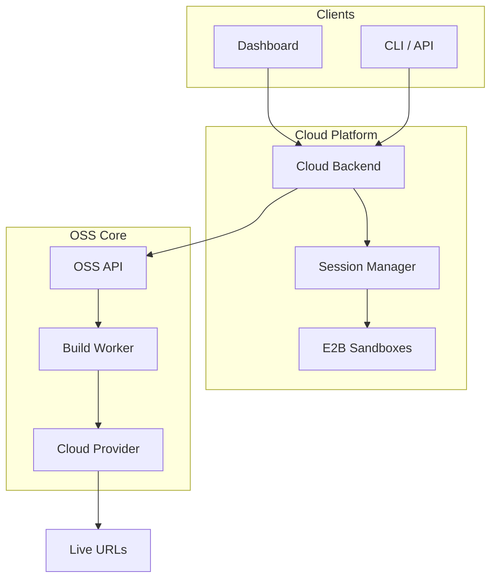

Runtm Cloud is the hosted version of Runtm, available at [app.runtm.com](https://app.runtm.com). It builds on the open-source core with managed infrastructure, cloud sandboxing, background agents, and team features.

## OSS vs Cloud

| Capability | OSS (Self-Hosted) | Cloud (Hosted) |
|-----------|-------------------|----------------|
| **Deploy to live URLs** | Yes | Yes |
| **CLI** | Yes | Yes |
| **REST API** (Deployments, Domains, Logs) | Yes | Yes |
| **Local sandbox sessions** | Yes (bubblewrap / seatbelt) | Yes |
| **Cloud sandbox sessions** | No | Yes (E2B isolation) |
| **Background agents via API** | No | Yes |
| **Telemetry & observability** | Basic | Full (traces, metrics, events) |
| **Teams & organizations** | No | Yes |
| **GitHub App integration** | No | Yes |
| **Managed infrastructure** | You manage | We manage |
| **Custom org templates** | No | Yes |

## Cloud-Only Features

<CardGroup cols={2}>
  <Card title="Cloud Sandboxing" icon="shield" href="/cloud/sandboxing">
    Isolated E2B environments with full OS-level sandboxing
  </Card>
  <Card title="Background Agents" icon="robot" href="/cloud/background-agents">
    Launch autonomous coding agents via API
  </Card>
  <Card title="Telemetry" icon="chart-line" href="/cloud/telemetry">
    Traces, metrics, and events for your deployments
  </Card>
  <Card title="Sessions API" icon="code" href="/api/sessions/launch">
    Programmatic session management
  </Card>
</CardGroup>

## Architecture

The cloud platform runs as a layer on top of the OSS API:



## Getting Started

<Steps>
  <Step title="Create an account">
    Sign up at [app.runtm.com](https://app.runtm.com)
  </Step>
  <Step title="Create an API key">
    Go to Settings and create an API key with `sessions` and `deploy` scopes
  </Step>
  <Step title="Launch your first agent">
    ```bash
    curl -X POST "https://app.runtm.com/api/v0/sessions/launch" \
      -H "Authorization: Bearer runtm_xxx" \
      -H "Content-Type: application/json" \
      -d '{"prompt": "Build a landing page", "template": "static-site"}'
    ```
  </Step>
  <Step title="Poll for results">
    ```bash
    curl -H "Authorization: Bearer runtm_xxx" \
      "https://app.runtm.com/api/v0/sessions/{id}"
    ```
  </Step>
</Steps>

## API Scopes

Cloud API keys can be configured with specific scopes:

| Scope | Permissions |
|-------|-------------|
| `read` | List deployments, view logs, query telemetry |
| `deploy` | Create/update deployments, ingest telemetry (includes `read`) |
| `delete` | Destroy deployments (includes `read`) |
| `sessions` | Create/manage sandbox sessions, launch background agents |
| `admin` | Full access including token management |
