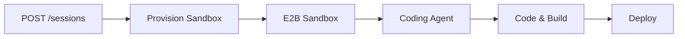
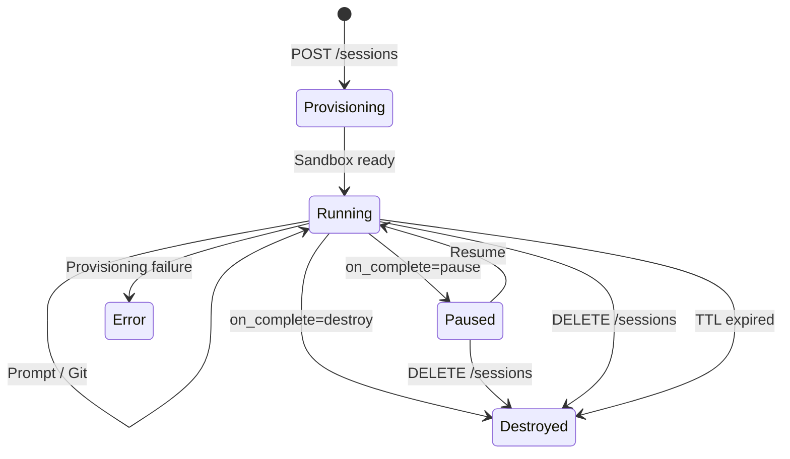

Cloud sandboxing provides fully isolated execution environments powered by [E2B](https://e2b.dev). Each session gets its own sandbox with a complete Linux environment, file system, and network access.

## How It Works

When you create a cloud session, Runtm provisions an E2B sandbox:



Each sandbox includes:
- **Full Linux environment** with shell access
- **Coding agent** (Claude Code, Codex, etc.) pre-configured
- **File system** for reading, writing, and managing project files
- **Network access** for installing packages and API calls
- **Git** for version control operations

## Session Lifecycle

Sessions move through a defined lifecycle:



| State | Description |
|-------|-------------|
| `provisioning` | Sandbox is being created (2-5 seconds) |
| `running` | Sandbox is active, ready for prompts and git operations |
| `paused` | Sandbox is suspended (files preserved, no compute cost) |
| `error` | Provisioning or execution failed |
| `destroyed` | Sandbox deleted, all data gone |

## Lifecycle Policies

Control what happens when a prompt completes:

| Policy | Behavior |
|--------|----------|
| `pause` (default) | Sandbox pauses after prompt — saves resources, files preserved |
| `destroy` | Sandbox is destroyed after prompt — one-shot tasks |
| `keep_alive` | Sandbox stays running — for interactive or multi-prompt workflows |

## TTL (Time-to-Live)

Every session has a TTL that automatically destroys it after a set duration:

- **Default**: 60 minutes for API-created sessions
- **Range**: 1 to 1440 minutes (24 hours)
- **Behavior**: Session is destroyed when TTL expires, regardless of prompt status

```bash
curl -X POST "https://app.runtm.com/api/v0/sessions/launch" \
  -H "Authorization: Bearer runtm_xxx" \
  -H "Content-Type: application/json" \
  -d '{
    "prompt": "Build and test a REST API",
    "ttl_minutes": 120,
    "on_complete": "keep_alive"
  }'
```

## Security Model

Each sandbox provides:

- **OS-level isolation** via E2B's micro-VM technology
- **Separate file system** — no access to host or other sandboxes
- **Scoped network** — outbound access only
- **User-scoped access** — API keys can only access sessions they created
- **Automatic cleanup** — destroyed sessions are fully wiped

<Info>
Cloud sandboxes run on E2B's infrastructure. For local sandboxing using bubblewrap (Linux) or seatbelt (macOS), see the [CLI session docs](/cli/session).
</Info>

## Supported Agents

| Agent | ID | Description |
|-------|------|-------------|
| Claude Code | `claude-code` | Anthropic's coding agent (default) |
| Codex | `codex` | OpenAI's coding agent |
| GitHub Copilot | `github-copilot` | GitHub's coding agent |
| OpenCode | `opencode` | Open-source coding agent |

## Supported Models

When using Claude Code:

| Model | ID | Best For |
|-------|------|----------|
| Sonnet | `sonnet` | General coding tasks (default, fastest) |
| Opus | `opus` | Complex multi-step tasks |
| Haiku | `haiku` | Simple tasks (lowest cost) |
| Opus Plan | `opusplan` | Architecture analysis and planning |
