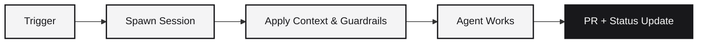

Background agents are autonomous coding runs. You hand off a task — a Linear ticket, a GitHub issue, a Slack message, or an API call — and the agent picks it up, writes code, runs tests, and reports back with a pull request. No one needs to watch.

Background agents use the same [coding agents](/concepts/coding-agents) and sandboxed VMs as interactive [sessions](/concepts/sessions). The difference is workflow:

| | Sessions | Background Agents |
|---|----------|--------|
| Mode | Interactive | Autonomous |
| Duration | Minutes to hours of human iteration | Until the task is done |
| Output | Real-time terminal, live preview | Pull request, status update, deploy |
| Trigger | Manual prompts | Tickets, issues, scheduled jobs, API calls |
| Best for | Building, debugging, exploring | Bug fixes, ticket execution, batch tasks |

Both show up in mission control with the same observability: you can see every prompt, tool call, file change, and cost.

## Triggers

Background agents can be launched from anywhere:

<CardGroup cols={2}>
  <Card title="Linear" icon="circle-dot">
    Tag the Runtime bot on a Linear issue. The agent picks up the ticket, writes code, opens a PR, and posts back when done.
  </Card>
  <Card title="Slack" icon="hashtag">
    Mention the bot in a channel with a task. The agent runs in the background and replies with the result.
  </Card>
  <Card title="GitHub" icon="github">
    Comment on an issue or PR to launch an agent. It can fix bugs, address review comments, or implement features end-to-end.
  </Card>
  <Card title="API" icon="code">
    Launch agents programmatically with `POST /api/sessions` and your own automation. Useful for batch jobs or CI pipelines.
  </Card>
</CardGroup>

## How a background run works

1. **Trigger fires** — a Linear ticket is tagged, a Slack message is posted, or your code calls the API
2. **Session spawns** — Runtime boots a sandboxed VM with the chosen [coding agent](/concepts/coding-agents), optionally from a [template](/concepts/templates) snapshot
3. **Context applies** — org and user [instructions](/concepts/context), required [skills](/concepts/skills), and [guardrails](/concepts/guardrails) are loaded
4. **Repository clones** — the linked GitHub repo is cloned into the workspace
5. **Agent runs** — reads the prompt, plans, writes code, runs tests, iterates on errors
6. **Output ships** — commits, opens a PR, posts back to the trigger source (Linear, Slack, etc.)

The whole run is logged. Every prompt, tool call, file edit, command, and cost event is captured in [activity](/concepts/observability).

## Modes

Background agents can run in different modes depending on how much autonomy you want:

- **Autopilot** — the agent runs end-to-end without stopping for input
- **Plan mode** — the agent generates a plan first, asks for approval, then executes
- **Interactive** — you can step in mid-run by sending follow-up prompts

Mode is set at creation time.

## Mission control

The dashboard's **Agents** view is mission control for background runs. It shows:

- Every agent currently running, its progress, and what it is doing right now
- Status (idle, running, waiting for review, completed, errored)
- Cost so far (tokens, API calls, compute time)
- Pause, resume, or destroy actions
- Direct link into the session workspace if you want to inspect or take over

You can always promote a background run into an interactive session. Open the agent in the dashboard and click "enter workspace".

## Cost controls

Background agents are subject to the same [guardrails](/concepts/guardrails) as interactive sessions:

- Per-org spend limits cap how much agents can consume per day or month
- Per-user budgets prevent any single person from triggering runaway agents
- Model allowlists restrict which LLMs agents can use
- Deployment gates require human approval for production deploys

See [Guardrails](/concepts/guardrails) for the full list.

## Sessions vs background agents

| You want to ... | Use |
|-----------------|-----|
| Iterate hands-on with an agent in real time | [Session](/concepts/sessions) |
| Hand off a ticket and walk away | Background agent |
| Run many tasks in parallel without watching | Background agents |
| Pair-program with the agent on a complex feature | Session |
| Trigger from a webhook or external tool | Background agent |
| Have a chat with the agent in a terminal | Session |
