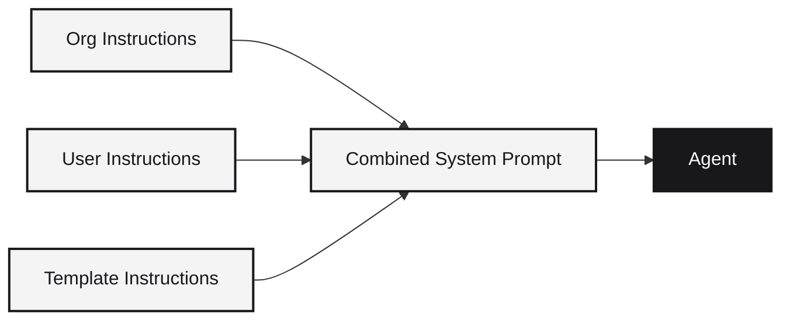

Context is everything an agent brings into a session beyond the prompt itself. It determines the rules the agent follows, the tools it has access to, and the reference material it can search.

The dashboard's **Context** page has five tabs. Each one controls a different layer of what the agent sees:

| Tab | What it is |
|-----|-----------|
| [Instructions](#instructions) | System-level markdown prompts every session inherits |
| [Skills](#skills) | Reusable instruction bundles with files, tooling, and integrations |
| [MCP](#mcp-servers) | Model Context Protocol servers that give agents additional tools |
| [Docs](#docs) | Reference URLs the agent treats as authoritative documentation |
| [Knowledge](#knowledge-sources) | Connected external platforms (Notion, Confluence, etc.) the agent can search |

## Instructions

Instructions are markdown documents that agents treat as a system prompt. They apply automatically to every session created in the org or by the user.

### How they layer

Three layers combine into the system prompt the agent sees:

1. **Org instructions** - rules that apply to every session in the organization. Set by admins. Useful for coding standards, security rules, or stack-wide conventions.
2. **User instructions** - personal preferences set by each user. Useful for style preferences ("use 2-space indents") or recurring context ("our team uses Vue, not React").
3. **Template instructions** - if the session was created from a [template](/concepts/templates), the template's default instructions apply too.

Instructions work across every supported agent (Claude Code, Codex, Gemini CLI, Cursor) without any per-agent configuration.

### What to put in instructions

Good instructions tend to fall into these categories:

- **Coding standards** - "Always use type hints in Python", "Prefer composition over inheritance"
- **Architecture rules** - "Routes go in `api/`, services in `services/`", "Use Pydantic models for validation"
- **Security constraints** - "Never log API keys", "Use parameterized queries"
- **Stack constraints** - "Use FastAPI not Flask", "Frontend is Next.js with Tailwind"
- **Protected files** - "Never edit `runtm.yaml` directly"
- **Project context** - "We are a fintech with strict audit requirements"

### API endpoints

- `GET/PUT /api/instructions` - personal user instructions
- `GET/PUT /api/organizations/{id}/instructions` - org-wide instructions

See [User Instructions](/cloud-api/context/user-instructions) and [Org Instructions](/cloud-api/context/org-instructions).

## Skills

Skills are versioned, reusable bundles that teach an agent how to do something. Each skill can include:

- **Entry markdown** (`SKILL.md`) - the main instruction document the agent reads
- **Reference files** - code samples, schemas, examples, or configuration templates
- **Required tooling** - system packages installed in the sandbox at build time (via mise)
- **Required integrations** - knowledge sources the skill depends on

Skills can be scoped to **personal** (visible only to you) or **teams** (shared across the org). They can be attached to all repos or specific ones.

### Creating skills

Skills are created from the dashboard's Context > Skills tab, imported from a Git repository, or managed via the API:

- Write a `SKILL.md` with YAML frontmatter defining the name, description, and version
- Optionally add reference files, tooling requirements, and integration dependencies
- Publish the skill so it is available to sessions
- Attach it to a [template](/concepts/templates) or individual sessions

### Versioning

Skills are versioned. When you update a skill, you publish a new version. Templates and sessions can pin to a specific version or float to the latest.

### Importing from Git

You can keep skill source files in a Git repository and pull them into Runtime:

- Use **Discover** to scan a connected repo for directories that look like skills
- Use **Import** to pull in a skill from a specific path
- Use **Resync** to refresh the skill content when the repo changes

See the dedicated [Skills](/concepts/skills) page for the full SKILL.md format, MCP configuration, and authoring guide.

## MCP servers

[Model Context Protocol](https://modelcontextprotocol.io) servers give agents additional tools beyond their built-in capabilities. MCP is a standard for connecting AI models to external data and actions.

Each MCP server registration defines:

| Field | Purpose |
|-------|---------|
| **Transport** | `stdio` (local executable), `http` (remote server), or `sse` (server-sent events) |
| **Command / URL** | What to run or connect to |
| **Args** | Command-line arguments (stdio only) |
| **Env / Headers** | Environment variables or HTTP headers (can reference secrets like `${GITHUB_TOKEN}`) |

### How MCP servers are applied

MCP servers can be scoped to personal or team, and attached to all repos or specific ones. When a session boots:

1. All matching MCP server registrations are collected (personal + org)
2. Each server is merged into the agent's MCP configuration
3. The agent sees the new tools in its tool catalog and can call them during prompts

### Examples

| Server | Transport | What it provides |
|--------|-----------|-----------------|
| GitHub MCP | stdio | Repository search, file read, issue management |
| Postgres MCP | stdio | Direct database queries |
| Custom internal API | http | Company-specific tools and data |
| Weather API | sse | Real-time external data |

MCP servers can also be declared inside [skills](#skills). When a skill with MCP servers is attached to a session, the servers are configured automatically.

### API endpoints

MCP servers are managed under the same system as skills. See the [Skills API reference](/cloud-api/context/skills/list) with `type=mcp_v0`.

## Docs

Reference docs are URLs the agent should treat as authoritative documentation. Each entry is a single URL with a display name and description.

When applied to a session, reference docs appear as a managed block in the agent's system prompt (e.g. in `CLAUDE.md`), giving the agent a curated list of documentation to consult when working on related tasks.

Use reference docs for:

- Framework documentation (e.g. FastAPI docs, Next.js docs)
- Internal API documentation
- Style guides and design systems
- Runbooks and playbooks

Docs can be scoped to personal or team and attached to all repos or specific ones.

### API endpoints

Docs are managed with `type=doc_v0`. See the [Skills API reference](/cloud-api/context/skills/list).

## Knowledge sources

Knowledge sources connect external documentation platforms directly into sessions. Unlike reference docs (which are just URLs), knowledge sources give the agent tools to search and read content programmatically.

Supported platforms include:

- **Documentation sites** (Mintlify, Docusaurus, ReadMe)
- **Notion workspaces**
- **Confluence spaces**
- **Custom API-backed sources**

Each provider defines the tools it exposes to agents (`search_pages`, `read_doc`, `list_articles`, etc.). The [Knowledge catalog](/cloud-api/context/knowledge/catalog) lists every supported provider and its capabilities.

### How knowledge sources work

1. An admin connects a knowledge provider via OAuth or static API key
2. The provider's tools are registered in the agent's MCP configuration
3. Agents can search and read content during prompts, just like they use any other tool
4. Content stays in the source system; Runtime fetches it on demand

Knowledge sources can be scoped to personal (your own connections) or org-wide (shared with all members).

### API endpoints

See the [Knowledge API reference](/cloud-api/context/knowledge/list).

## How sessions get context

When a session boots, all five layers are resolved and merged:

1. **Org instructions** are loaded
2. **User instructions** are appended
3. **Template instructions** (if applicable) are merged in
4. **Skills** are mounted into the workspace, their tooling verified, and their MCP servers configured
5. **MCP servers** (standalone registrations) are added to the agent's tool catalog
6. **Reference docs** are rendered into the agent's system prompt
7. **Knowledge sources** are made available as callable tools

The agent sees all of this as a single coherent system prompt and tool catalog before it processes the user's first prompt.

## Best practices

- **Keep org instructions small and stable.** They apply to every session; bloat slows everything down.
- **Use skills for specialized workflows.** If guidance only applies to a subset of work, make it a skill and attach it to the relevant repos.
- **Use knowledge sources for content that changes.** Anything that updates frequently (docs, runbooks) belongs in a knowledge source rather than in instructions.
- **Personal context is for individuals.** Anything the whole team needs should be at the org level.
- **Pin skill versions in production.** When stability matters, attach skills by version rather than floating to latest.

## Related guides

<CardGroup cols={2}>
  <Card title="Teach the agent your codebase" icon="brain" href="/guides/teach-the-agent-your-codebase">
    AGENTS.md, skills, and org instructions — how the three layers compose.
  </Card>
  <Card title="Best practices" icon="shield" href="/guides/best-practices">
    Key hygiene, prompt design, and cost controls.
  </Card>
</CardGroup>
