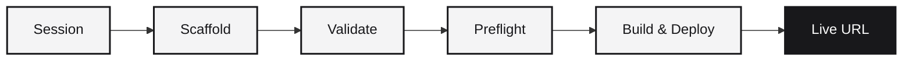

A deployment takes the code in a session and publishes it to a live URL. The deploy pipeline validates the project, builds a container, and launches it on infrastructure with HTTPS, health checks, and log streaming.

## The deploy pipeline



Each step is available as a separate API endpoint so you can run them independently or chain them together:

| Step | Endpoint | What it does |
|------|----------|-------------|
| **Info** | `GET /api/sessions/{id}/deploy/info` | Check current deploy status and last deploy metadata |
| **Scaffold** | `POST /api/sessions/{id}/deploy/scaffold` | Generate a `runtm.yaml` manifest if one does not exist |
| **Validate** | `POST /api/sessions/{id}/deploy/validate` | Verify the project structure, manifest, and Dockerfile are valid |
| **Preflight** | `POST /api/sessions/{id}/deploy/preflight` | Check quotas, permissions, and resource availability |
| **Run** | `POST /api/sessions/{id}/deploy/run` | Execute the full build and deploy, streaming NDJSON logs |

## What gets deployed

The deploy system examines the session's workspace and detects the project type. It supports:

- **Node.js** - Express, Next.js, React, and other Node frameworks
- **Python** - FastAPI, Flask, Django, and other Python frameworks
- **Ruby** - Rails applications
- **Static sites** - HTML/CSS/JS served via a lightweight server
- **Docker** - bring your own Dockerfile for any stack

Each project type has a handler that generates the right build steps, Dockerfile, and configuration.

## Deploy manifest

Every deployable project needs a `runtm.yaml` at the workspace root:

```yaml
name: my-api
template: backend-service
port: 8080
health_path: /health
tier: starter
```

If the session does not have one, call the scaffold endpoint and the system will generate one based on the detected project structure.

## Streaming build logs

The `POST /api/sessions/{id}/deploy/run` endpoint streams NDJSON events as the build progresses:

```json
{"type": "log", "message": "Building container..."}
{"type": "log", "message": "Installing dependencies..."}
{"type": "progress", "phase": "deploying", "percent": 75}
{"type": "complete", "url": "https://my-api-xyz123.fly.dev", "deployment_id": "dep_abc123"}
```

This lets you show real-time progress in your UI or log the output for debugging.

## Volumes

Sessions that need persistent storage across redeploys can configure volumes:

- `GET /api/sessions/{id}/deploy/volumes` - read current volume configuration
- `PUT /api/sessions/{id}/deploy/volumes` - update volume mounts

Volumes survive redeploys and are useful for databases, uploaded files, and caches.

## Redeploying

Deploying again to the same project name updates the existing deployment. The system detects changes, rebuilds only what is necessary, and swaps to the new version with minimal downtime.

## Permissions

Deploying requires the `deployments:write` scope on your API key. The preflight step also checks that the session's owner has sufficient quota for the target tier.

See [Deploy Info](/cloud-api/deploy/info) for the full API reference.
