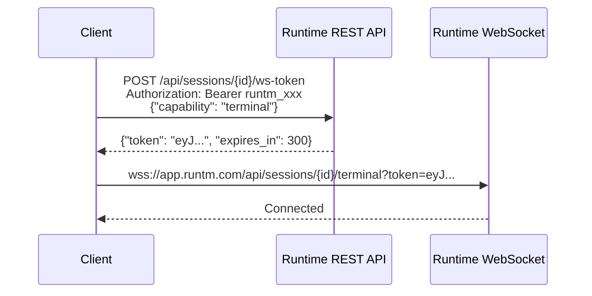

Runtime exposes three WebSocket channels for real-time interaction with sessions. They power the same live experience you see in the dashboard: streaming terminal output, watching an agent think and code, and seeing who else is working in the same session.

## Three channels

| Channel | What it does | Scope required |
|---------|-------------|----------------|
| [Terminal](/cloud-api/websockets/terminal) | Bidirectional PTY - send keystrokes, receive stdout/stderr | `sessions:terminal` |
| [Prompt](/cloud-api/websockets/prompt) | Stream agent events as a prompt executes | `sessions:prompt` |
| [Collaboration](/cloud-api/websockets/collaboration) | Presence indicators and prompt status notifications | `sessions:read` |

All three use the same authentication flow: mint a short-lived token via REST, then pass it as a query parameter when opening the WebSocket.

## Token exchange

WebSockets cannot send custom HTTP headers in the browser, so Runtime uses a token exchange pattern:



1. Call `POST /api/sessions/{id}/ws-token` with your API key and the capability you need
2. Receive a short-lived, single-purpose token
3. Open the WebSocket with `?token=...` immediately
4. If the token expires before you connect, mint a new one

See [Token Exchange](/cloud-api/websockets/token-exchange) for the full API reference.

## Terminal WebSocket

The terminal channel gives you an interactive shell inside a running session. It is the same PTY the dashboard renders.

**Protocol:**
- **Binary frames** carry raw stdin (client to server) and stdout/stderr (server to client)
- **JSON text frames** carry control messages: `resize` (update terminal dimensions), `ping`/`pong` (keepalive), `settings` (terminal configuration)

**Typical flow:**

```python
import websockets
import requests

session_id = "3b1e8e74-..."
token_resp = requests.post(
    f"https://app.runtm.com/api/sessions/{session_id}/ws-token",
    headers={"Authorization": "Bearer runtm_xxx"},
    json={"capability": "terminal"},
)
ws_token = token_resp.json()["token"]

async with websockets.connect(
    f"wss://app.runtm.com/api/sessions/{session_id}/terminal?token={ws_token}"
) as ws:
    await ws.send(b"ls -la\n")
    async for message in ws:
        if isinstance(message, bytes):
            print(message.decode(), end="")
```

See [Terminal WebSocket](/cloud-api/websockets/terminal) for the complete protocol reference.

## Prompt WebSocket

The prompt channel lets you send a prompt and receive structured agent events as the agent works. Each WebSocket connection handles exactly one prompt.

**Client sends:**

```json
{
  "prompt": "Add rate limiting to the API",
  "model": "claude-sonnet-4-20250514",
  "plan_mode": false
}
```

**Server streams back:**

- `accepted` - prompt was received and the agent is starting
- Agent events - tool calls, file edits, terminal commands, thinking
- `done` - agent finished, with a summary of changes
- `error` - something went wrong

This is useful for building custom UIs that show the agent's progress in real time, or for logging every step of an automated pipeline.

See [Prompt WebSocket](/cloud-api/websockets/prompt) for the full event schema.

## Collaboration WebSocket

The collaboration channel is read-only. It streams events about what is happening in a session:

- **`presence`** - who is currently viewing the session
- **`prompt_started`** / **`prompt_completed`** - a user started or finished a prompt
- **`visibility_changed`** - the session's visibility was updated

This powers the "X is prompting..." indicators and collaborator dots in the dashboard. It only requires `sessions:read` scope, making it safe for monitoring dashboards.

See [Collaboration WebSocket](/cloud-api/websockets/collaboration) for the event reference.

## When to use REST vs WebSocket

| Use case | Best option |
|----------|------------|
| Send a prompt and wait for the result | REST `POST /api/sessions/{id}/prompt` |
| Send a prompt and show progress in real time | Prompt WebSocket |
| Run commands in an interactive shell | Terminal WebSocket |
| Monitor who is working in a session | Collaboration WebSocket |
| Manage files, read history, configure sessions | REST API |

The REST prompt endpoint is simpler but blocks until the agent is done. The WebSocket prompt endpoint gives you streaming events and is better for interactive UIs.

## Related guides

<CardGroup cols={2}>
  <Card title="Stream prompts over WebSockets" icon="bolt" href="/guides/streaming-prompts-over-websockets">
    Token exchange, event types, and reconnection patterns.
  </Card>
  <Card title="Handle long-running prompts" icon="hourglass" href="/guides/long-running-prompts">
    REST vs WebSocket, cancel, rewind, and history replay.
  </Card>
</CardGroup>
