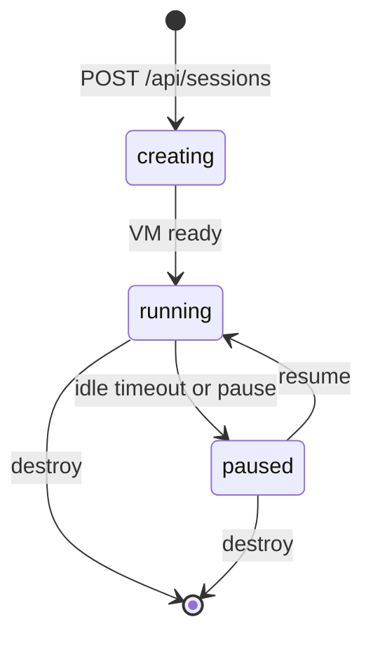

A session is a sandboxed cloud environment. Each session runs in its own VM with a full filesystem, terminal, and an AI agent that can write code, install packages, run tests, and deploy. Sessions are the core unit of work in Runtime.

<Info>
Every session is isolated. One VM per session, not shared containers. The filesystem is wiped when the session is destroyed. No cross-user or cross-session access.
</Info>

## What a session contains

Every session gets:

- **Isolated VM** - dedicated compute with its own kernel, filesystem, and network namespace
- **Workspace** - a full Linux filesystem where agents create, read, and edit files
- **Terminal** - an interactive PTY for running commands, accessible via WebSocket
- **Agent** - a [coding agent](/concepts/coding-agents) (Claude Code, Codex, OpenCode, GitHub Copilot, Cursor, Devin, or Gemini) that responds to prompts
- **Live preview** - port-forwarded HTTPS URLs for whatever services the agent runs
- **Git integration** - clone repos, commit, push, and create PRs
- **Context** - org and user [instructions, skills, and knowledge](/concepts/context) applied automatically
- **Guardrails** - allowlists, deployment gates, and policies enforced at the VM level

You interact with sessions through the [REST API](/cloud-api/sessions/manage), [WebSockets](/concepts/real-time), or the dashboard at [app.runtm.com](https://app.runtm.com).

## Session lifecycle

Sessions move through a set of states:



| State | Meaning |
|-------|---------|
| `creating` | VM is being provisioned. Typically takes a few seconds. |
| `running` | Active and accepting prompts, terminal connections, and file operations. |
| `paused` | Frozen to save resources. No compute charges. Resumes in seconds. |
| `destroyed` | Permanently removed. Filesystem wiped. Cannot be recovered. |

### Auto-pause

Running sessions that receive no activity for 20 minutes are automatically paused. The dashboard sends heartbeats to keep sessions alive while you're viewing them. API callers should send periodic heartbeats via `POST /api/sessions/{id}/heartbeat` if they need long-lived sessions.

### Resuming

A paused session resumes when you call any mutating endpoint (prompt, file write, resume) or open a terminal WebSocket. The session returns to `running` within a few seconds with the filesystem intact.

## Creating sessions

At minimum, a session needs a name:

```bash
curl -X POST https://app.runtm.com/api/sessions \
  -H "Authorization: Bearer runtm_xxx" \
  -H "Content-Type: application/json" \
  -d '{"name": "feature-login-flow"}'
```

You can also specify:

- **`template_id`** - boot from an [environment template](/concepts/templates) snapshot instead of a blank workspace
- **`agent`** - which [coding agent](/concepts/coding-agents) to use (`claude-code`, `codex`, `opencode`, `github-copilot`, `cursor-cli`, `devin-cli`, `gemini-cli`)
- **`git_url`** - clone a repository into the session on creation
- **`env_vars`** - inject environment variables the agent can use
- **`max_duration_minutes`** - hard limit before the session is automatically destroyed
- **`visibility`** - `private` (creator only) or `team` (all org members)

See the full parameter list in [Create Session](/cloud-api/sessions/manage#create-session).

## Prompting agents

Once a session is running, send work to the agent:

```bash
curl -X POST "https://app.runtm.com/api/sessions/${SESSION_ID}/prompt" \
  -H "Authorization: Bearer runtm_xxx" \
  -H "Content-Type: application/json" \
  -d '{"prompt": "Add user authentication with JWT tokens"}'
```

The agent reads the prompt, examines the codebase, writes code, installs dependencies, and runs tests. You get back a structured response with what changed.

For streaming output in real time, use the [Prompt WebSocket](/cloud-api/websockets/prompt) instead. It sends agent events as they happen: tool calls, file edits, terminal commands, and completion status.

## Working with files

Sessions expose a full file API for reading, writing, listing, searching, uploading, and downloading:

| Operation | Endpoint |
|-----------|----------|
| List files | `GET /api/sessions/{id}/files` |
| Read a file | `GET /api/sessions/{id}/files/read` |
| Write a file | `POST /api/sessions/{id}/files/write` |
| Upload a file | `POST /api/sessions/{id}/files/upload` |
| Download a file | `GET /api/sessions/{id}/files/download` |
| Search content | `GET /api/sessions/{id}/files/search` |

See the [Files](/cloud-api/sessions/files-list) reference for all operations.

## Terminal access

For interactive shell access or to watch agent commands in real time, connect via the [Terminal WebSocket](/cloud-api/websockets/terminal):

1. Mint a WebSocket token: `POST /api/sessions/{id}/ws-token` with `capability: "terminal"`
2. Connect: `wss://app.runtm.com/api/sessions/{id}/terminal?token=...`
3. Send keystrokes, receive stdout/stderr, resize the terminal

This is the same terminal the dashboard uses.

## Collaboration

Sessions can be shared with teammates. Multiple users can view the same session simultaneously, see each other's presence, and watch prompts execute in real time.

- **Visibility** - sessions can be `private` (creator only) or `team` (all org members)
- **Presence** - the [Collaboration WebSocket](/cloud-api/websockets/collaboration) streams who is viewing and what is happening
- **Collaborators** - `GET /api/sessions/{id}/collaborators` lists users who have accessed the session

## Sessions vs Agents

Sessions are interactive environments you work in. [Agents](/concepts/agents) are background autonomous coding tasks that fire-and-forget. Both run inside the same kind of VM, but agents are designed for handoff workflows (Linear ticket in, PR out) while sessions are designed for hands-on iteration.

## Scoping

Sessions are always owned by the user who created them. If the user belongs to an organization and created the session with an org-scoped API key, the session can be visible to other org members (depending on visibility).

Personal-key sessions are private by default and only accessible to the creator.

See [Organizations](/concepts/organizations) for how team access works.

## Related guides

<CardGroup cols={2}>
  <Card title="Manage sessions at scale" icon="cube" href="/guides/managing-sessions-at-scale">
    Polling, heartbeats, retries, and error recovery patterns.
  </Card>
  <Card title="Stream prompts over WebSockets" icon="bolt" href="/guides/streaming-prompts-over-websockets">
    Real-time agent output with event streaming.
  </Card>
  <Card title="Work with session files" icon="file" href="/guides/working-with-files">
    Read, write, upload, and download files in the sandbox.
  </Card>
  <Card title="Handle long-running prompts" icon="hourglass" href="/guides/long-running-prompts">
    Cancel, rewind, and replay prompt history.
  </Card>
</CardGroup>
