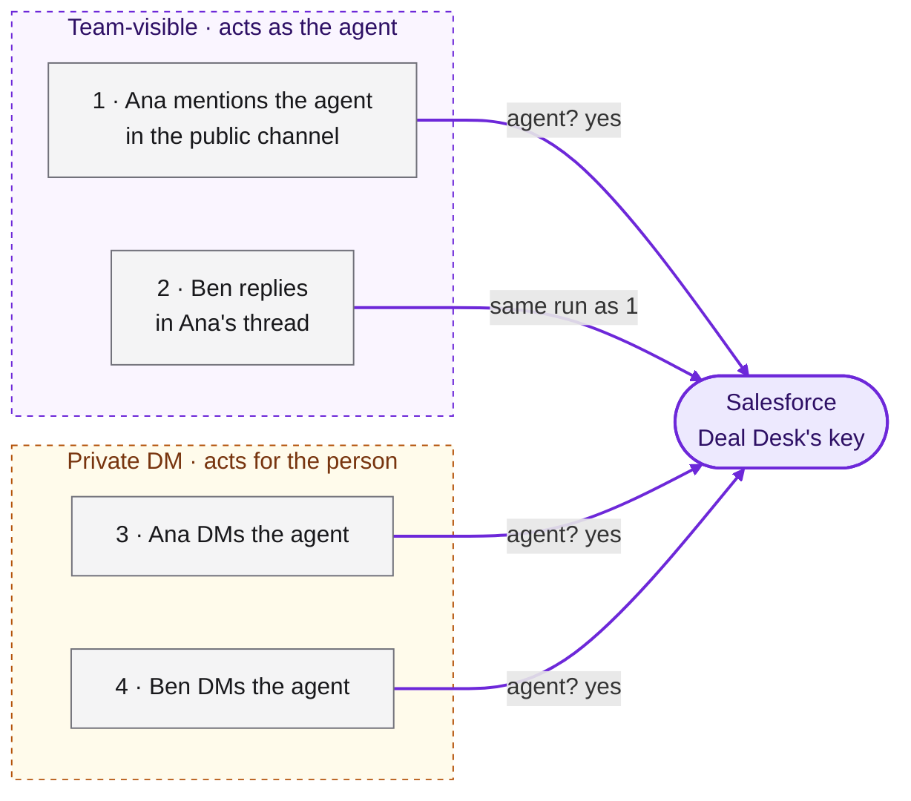
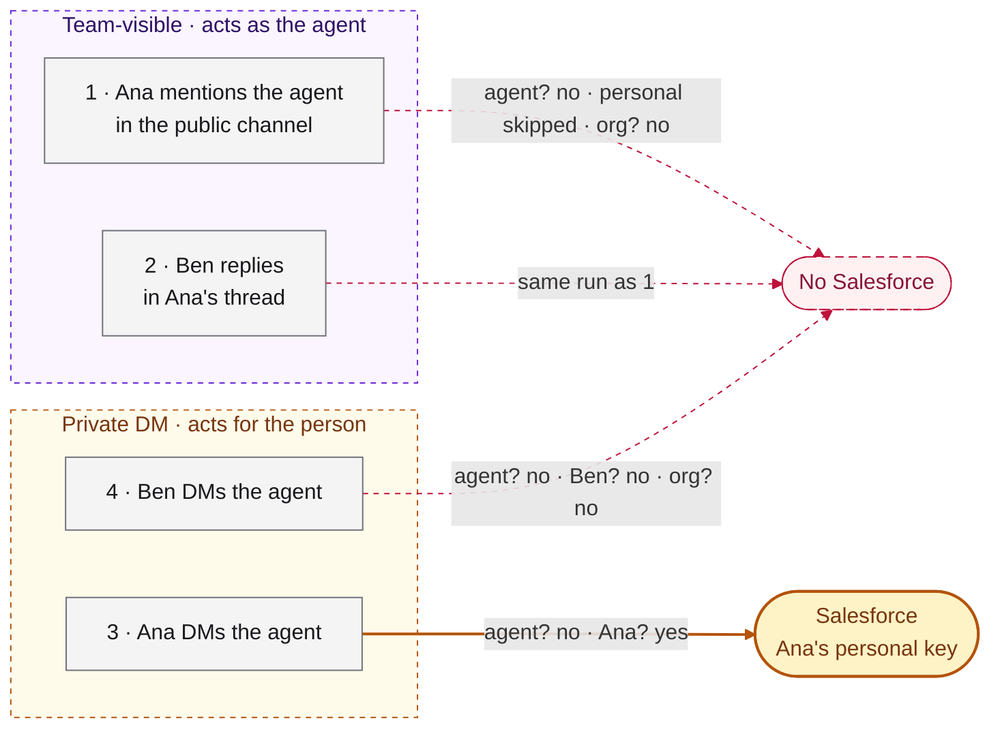
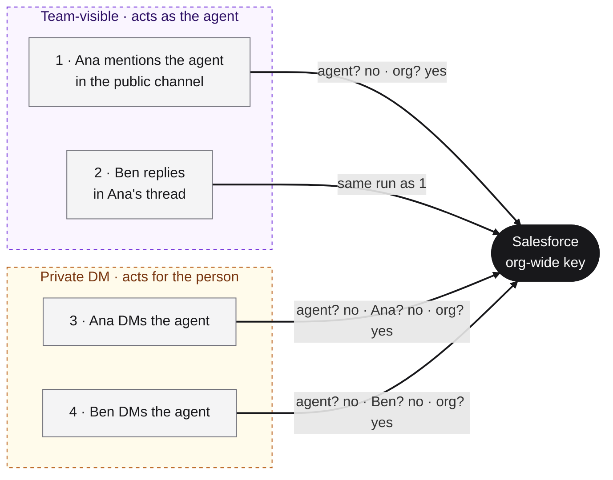
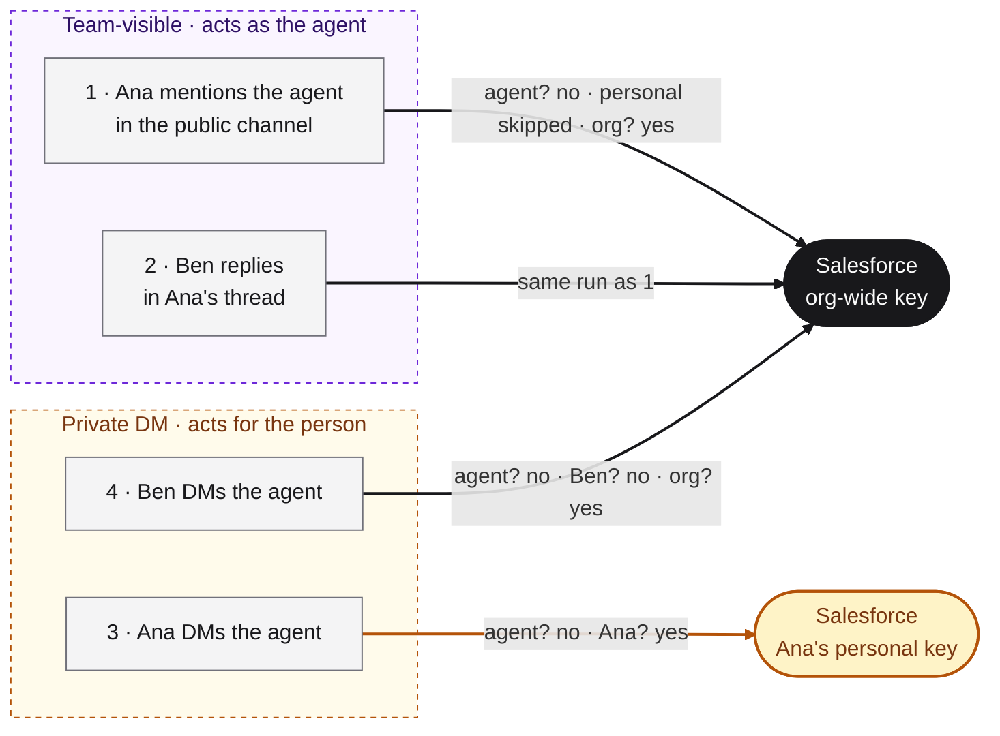

Tools are what an agent uses to reach a vendor during a run: Stripe, Zendesk, BigQuery, Notion, a database. They are configured under **Settings > Context > Tools & MCP**. They are not [integrations](/concepts/integrations), which start runs and carry results back (a Slack integration does not give the agent Slack tools, and a Slack tool provider does not make the agent answer mentions).

**Knowledge sources** is the older name for tool providers. It survives in the API paths (`/api/knowledge/providers`, `/api/knowledge/integrations`) and in older pages, and it means the same thing: any vendor an agent reads from or acts on, not only documentation.

## Providers, connections and attachments

Every tool is made of up to three separate objects, and only one of them holds a secret.

| Object | What it is | Holds a secret? | API |
|---|---|---|---|
| **Provider** (tool provider) | The definition: the service, the auth methods it accepts (static fields, OAuth, or browser login), how credentials are materialized in the sandbox (env vars, files, setup commands), and any CLI to install with mise. Either **managed** (a catalog entry seeded by Runtime) or **custom** (created or forked by your org). | No | [`/api/knowledge/providers`](/cloud-api/context/knowledge/list) |
| **MCP server** | The other kind of definition: an `mcp_server_v0` directive with a `stdio` command or an `http` / `sse` URL, exposing a fixed set of typed tools. | No | `/api/agent-directives` |
| **Connection** | A set of credentials supplied against one provider or MCP server: an API key, OAuth token, service account file or saved browser login. Stored encrypted, with a `status` and a scope. The API never returns the secret, only `has_credentials` and `status`. | **Yes** | [`/api/knowledge/integrations`](/cloud-api/context/knowledge/create) for providers, `/api/agent-directives/{id}/connections` for MCP servers |
| **Attachment** | Where a skill or MCP server loads: a template, a repo, or every repo in the org. | No | `/api/agent-directives/{id}/attachments` |

One provider can have many connections, for example one per agent that uses it. Creating a provider attaches it nowhere and grants no credentials. Creating a connection does not by itself put the tool in a session either: an org-wide or personal connection reaches a template only when an attached skill lists the provider slug in `requires.integrations`. Agent-scoped connections skip that filter.

When a provider is the right choice over an MCP server, the agent should reach the vendor through the first surface that covers the job: its **CLI** (installed with an `npm:` or `github:` mise spec), then its **SDK**, then its **HTTP API**, and a **browser** auth method only when the vendor has no programmatic access. See [How should the agent reach the vendor?](/build/give-it-tools#decide).

## Scope connections to the agent

Every connection lives at one of three scopes. **Default to agent scope**, and use the others only when the job requires them.

| Scope | Used by | Use it when |
|---|---|---|
| **Agent** (the default) | Only runs of that roster agent | Always, for any tool a roster agent uses. The agent gets its own identity and the narrowest grant its job needs, its actions are attributable to it, and revoking or rotating the key affects one agent only |
| **Personal** | Only that person's private sessions: their DMs with an agent and the sessions they open from the dashboard. Never a team-visible run | The work must act as the person, such as their own calendar or inbox, or a person works interactively in a dashboard session, where agent connections never apply |
| **Org-wide** | Every session in the org whose template asks for the provider | Many agents and people genuinely need the same read-only access and a separate credential per agent is not practical. Keep it the least privileged credential in the org, because it is the floor every run falls back to |

- Bad: "Connect Stripe org-wide so every agent can use it."
- Good: "An agent-scoped restricted Stripe key for Payment Support and a separate one for Risk Agent, each with only the read scopes that job needs."

## Which connection a run uses

The rule behind everything below: **a personal credential is only ever used where no one else can see the session.** In practice that means a person's own DM with an agent, or their own dashboard session. Anywhere shared, the agent acts as itself.

A run acts either **as the agent** or **for a person**, and that decides whether personal connections are ever considered.

- **Team-visible runs act as the agent.** Anything an agent does in a shared place: a mention in a Slack channel or group DM, an email, a Linear or GitHub trigger, a schedule. Replies in the thread join the same run. These runs never use anyone's personal connection.
- **Private sessions act for a person.** A DM with the agent, or a session someone opens from the dashboard. Only that person can see or use it, so their personal connections can fill in. Group DMs count as shared, not private. If a private session is later shared with the team, it stops being private, and personal connections no longer apply to it.

Runtime then picks one connection per provider, most specific first:

1. **Agent.** The run belongs to a roster agent and that agent has a connection for the provider.
2. **Personal, private sessions only.** The person in the session has a personal connection for it. Team-visible runs skip this step.
3. **Org-wide.** The org has one.
4. **None.** The session manifest lists the tool as an unmet requirement, and the run starts anyway, then fails when it calls the vendor.

This is the same rule GitHub follows. Tagged in a channel, an agent opens pull requests as its own GitHub App bot, not as the person who tagged it, and a reviewer agent reviews pull requests as its own account. In a DM, commits are authored as the person, with the agent as co-author.

A session opened from the dashboard runs as no agent, so agent connections never apply to it: it uses the person's personal connection, then the org-wide one. A Slack user with no Runtime account, and every email, WhatsApp or SMS sender, maps to the trigger's service user, which has no personal connections.

## Examples

The same agent and the same four runs, under four different setups. Only the connections change.

- **People:** Ana and Ben, both members of the org with Runtime accounts that match their Slack emails.
- **Agent:** Deal Desk, a roster agent whose runbook skill requires `salesforce`.
- **The four runs:**
  1. Ana mentions Deal Desk in the public `#sales` channel.
  2. Ben replies in Ana's thread.
  3. Ana DMs Deal Desk.
  4. Ben DMs Deal Desk.

How to read the diagrams: the runs on the left are grouped into the team-visible box (runs 1 and 2, acting as the agent) and the private box (runs 3 and 4, acting for the person). Each arrow ends at the Salesforce credential the run receives, and its label is the lookup it went through. Credentials are coloured by the scope that owns them, the same colours as [Who the agent acts as](/build/give-it-tools#who-the-agent-acts-as-the-credential-hierarchy):

| Colour | Meaning |
|---|---|
| Violet | the agent's own key |
| Amber | a person's personal key |
| Black | the org-wide key |
| Red, dashed | no credential: the run starts without Salesforce and fails when it calls it |

### Example 1: only an agent connection

Deal Desk has its own Salesforce connection: a dedicated integration user that can read opportunities and accounts and nothing else. Nobody has a personal key and there is no org-wide key. This is the recommended setup.



Every run uses the agent's key. The agent's connection is checked first and it exists, so whether the run is in a channel or a DM, and who asked, makes no difference. The agent's Salesforce actions are attributable to the agent, and rotating the key touches nothing else.

The only run that misses is one not in the diagram: Ana opening a session from the template in the dashboard. That session runs as no agent, so the agent's key doesn't apply. If she needs Salesforce while testing, she gives herself a personal connection.

### Example 2: only Ana's personal connection

Ana connected her own Salesforce login. The agent has none and there is no org-wide key.



Ana's key is used in exactly one place: her own DM. That is the only session that is both private and hers.

In the channel, Ana tagged the agent, but the run is team-visible and acts as the agent, so her personal key is never considered, even though she started the thread. Ben's reply joins the same run and gets the same answer, so nobody can reach Ana's credential by replying in her thread. With no agent key and no org key, both runs go without Salesforce.

Ben's DM is private but it is Ben's, and he has no key. Personal connections work for one person, in their own DMs, and nowhere else.

### Example 3: only an org-wide connection

The org has one Salesforce integration user shared by everyone. Neither the agent nor any person has their own.



Every run falls through to the org key, so everything works. The cost is that the credential belongs to no one in particular: the agent's actions can't be told apart from anyone else's, and anyone in the org who launches a session from a template that requires `salesforce` gets the same access, whether or not they have Salesforce access themselves. If you use an org-wide key, make it the least privileged credential in the org.

### Example 4: Ana's personal key plus an org-wide key, no agent key

This is the setup orgs drift into: an org-wide key from early on, and a teammate who later connected their own key. The agent was never given one.



The channel runs skip Ana's key and use the org key. Ben's DM has no personal key to use and also lands on the org key. Only Ana's DM uses her own key.

So in the same week the agent can act with two credentials: the org key everywhere, and Ana's key when Ana DMs it. If the two keys have different permissions, what the agent can do in a DM depends on who is asking. Adding one agent connection makes all four runs use the agent's key, as in example 1, and Ana keeps her personal key for her dashboard sessions.

### At a glance

| Run | Visibility | Agent only | Ana's personal only | Org-wide only | Ana's personal + org-wide |
|---|---|---|---|---|---|
| 1 · Ana mentions the agent in the public channel | Team | Agent key | **No Salesforce** | Org key | Org key |
| 2 · Ben replies in Ana's thread | Team | Agent key | **No Salesforce** | Org key | Org key |
| 3 · Ana DMs the agent | Private | Agent key | Ana's key | Org key | Ana's key |
| 4 · Ben DMs the agent | Private | Agent key | **No Salesforce** | Org key | Org key |

Give every roster agent its own connection for every tool it touches, so it always acts as itself. The multi-agent version of this, with two agents and a shared org key, is [Who the agent acts as](/build/give-it-tools#who-the-agent-acts-as-the-credential-hierarchy).

## Creating a connection

A person creates a connection, never an agent. The secret goes from the person's browser straight to Runtime and never appears in a chat, a prompt, a transcript or a repo. An agent that sets up a tool builds the provider and the skill that requires it, then gives the person a link:

```
https://app.runtm.com/connect?provider=<slug>&agent=<agent_id>&method=<auth_method_id>
```

The link opens **Settings > Context > Tools & MCP** with the provider selected and the connect dialog set to that agent. Use `scope=personal` or `scope=org` instead of `agent=` only when the job requires it (see the table above). `method` is optional. The person enters the credential and clicks **Connect**, and the agent confirms with `runtm-api tools list --provider <slug>`. All parameters are listed in [Credentials go to Runtime, never to an agent](/build/give-it-tools#credentials-go-to-runtime-never-to-an-agent).

<Visibility for="agents">

```text
cli-handoff: https://app.runtm.com/connect?provider=<slug>&agent=<agent_id>&method=<auth_method_id>
cli-verify: runtm-api tools list --provider <slug>
```

</Visibility>

MCP server connections have no link yet. Send the person to the server under **Tools & MCP** and ask them to click **Add connection**, choosing the agent scope there as well.

The full procedure, including custom providers and MCP servers, is [Give it tools](/build/give-it-tools).

## Permissions

Tool endpoints require the `integrations:read` or `integrations:write` scope and an org-scoped API key. Any member of the org can create a tool connection. A personal connection is visible to, and changeable by, only its owner.

## Related

<CardGroup cols={2}>
  <Card title="Give it tools" icon="plug" href="/build/give-it-tools">
    Providers, MCP servers, connections and the credential hierarchy, step by step.
  </Card>
  <Card title="Skills" icon="scroll" href="/concepts/skills">
    Skills declare `requires.integrations`, which decides which org-wide and personal connections reach a session.
  </Card>
</CardGroup>
