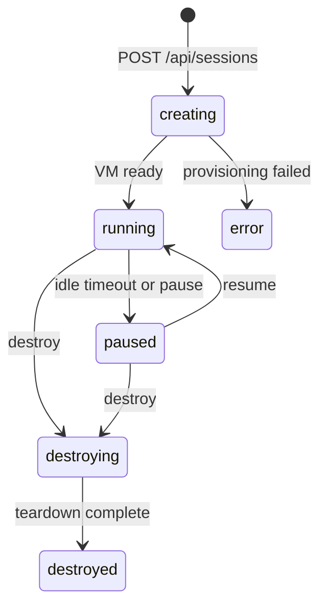

Sessions are the core unit of work in Runtime. This guide covers the patterns you need when managing sessions programmatically - whether you are calling the API from your own terminal, letting a coding agent spin up cloud environments, or orchestrating sessions from a CI pipeline.

For the full endpoint reference, see [Manage Sessions](/cloud-api/sessions/manage) and [Lifecycle](/cloud-api/sessions/lifecycle).

## When to use this

- You are calling the Runtime API from a local script, coding agent, or your own tooling
- You are orchestrating sessions from a CI pipeline or backend service
- You need sessions to stay alive during long-running jobs
- You want to handle edge cases (sandbox expiry, network errors, orphaned sessions) gracefully

## Prerequisites

- An API key with `sessions:read` and `sessions:write` scopes
- For prompts: `sessions:prompt` scope

## Session states

Every session moves through a fixed set of states:



| State | Meaning | Can accept prompts? |
|-------|---------|---------------------|
| `creating` | VM provisioning in progress | No |
| `running` | Active, ready for work | Yes |
| `paused` | Frozen to save resources | No (resumes on mutating call) |
| `destroying` | Teardown in progress | No |
| `destroyed` | Permanently removed | No |
| `error` | Provisioning or runtime failure | No |

## Wait for a session to become running

After `POST /api/sessions`, the session starts in `creating` state. You have two options:

### Option 1: Use the Start endpoint (recommended)

`POST /api/sessions/{id}/start` blocks until the session is running and the dev server is up. It handles every state transition transparently:

<CodeGroup>

```python Python
import requests

API_KEY = "runtm_xxx"
BASE = "https://app.runtm.com/api"
headers = {"Authorization": f"Bearer {API_KEY}"}

session = requests.post(
    f"{BASE}/sessions",
    headers=headers,
    json={"agent": "claude-code", "source": "api"},
).json()

ready = requests.post(
    f"{BASE}/sessions/{session['id']}/start",
    headers=headers,
).json()

print(f"State: {ready['state']}, preview: {ready.get('preview_url')}")
```

```javascript JavaScript
const API_KEY = "runtm_xxx";
const BASE = "https://app.runtm.com/api";
const headers = { Authorization: `Bearer ${API_KEY}` };

const session = await fetch(`${BASE}/sessions`, {
  method: "POST",
  headers: { ...headers, "Content-Type": "application/json" },
  body: JSON.stringify({ agent: "claude-code", source: "api" }),
}).then((r) => r.json());

const ready = await fetch(`${BASE}/sessions/${session.id}/start`, {
  method: "POST",
  headers,
}).then((r) => r.json());

console.log(`State: ${ready.state}, preview: ${ready.preview_url}`);
```

</CodeGroup>

### Option 2: Poll GET /api/sessions/{id}

If you need more control over the wait loop (e.g. to show a progress indicator), poll until `state` is `running`:

```python Python
import time
import requests

def wait_for_running(session_id, headers, timeout=120):
    deadline = time.time() + timeout
    while time.time() < deadline:
        resp = requests.get(
            f"https://app.runtm.com/api/sessions/{session_id}",
            headers=headers,
            params={"refresh": True},
        )
        data = resp.json()
        if data["state"] == "running":
            return data
        if data["state"] in ("error", "destroyed"):
            raise RuntimeError(f"Session entered {data['state']}: {data.get('error_message')}")
        time.sleep(2)
    raise TimeoutError("Session did not become running in time")
```

<Tip>
Poll with `refresh=true` (the default) to catch sandboxes that were destroyed externally. Pass `refresh=false` for faster reads when eventual consistency is acceptable.
</Tip>

## Keep sessions alive with heartbeats

Running sessions that receive no activity for 20 minutes are automatically paused. If you have gaps between prompts (e.g. waiting for a local build to finish, or processing results before the next step), send periodic heartbeats:

```bash
curl -X POST "https://app.runtm.com/api/sessions/${SESSION_ID}/heartbeat" \
  -H "Authorization: Bearer runtm_xxx"
```

A heartbeat resets the idle timer without doing any real work. Send one every 10-15 minutes during long gaps.

## Pause and resume

Use pause to save resources between bursts of work. Paused sessions accrue no compute cost and resume in seconds with the filesystem intact.

<CodeGroup>

```python Python
requests.post(f"{BASE}/sessions/{session_id}/pause", headers=headers)

# ... later ...

requests.post(f"{BASE}/sessions/{session_id}/resume", headers=headers)
```

```javascript JavaScript
await fetch(`${BASE}/sessions/${sessionId}/pause`, { method: "POST", headers });

// ... later ...

await fetch(`${BASE}/sessions/${sessionId}/resume`, { method: "POST", headers });
```

</CodeGroup>

Key behaviors:

- Pausing an already-paused session is a no-op (returns `200`)
- Pausing while a prompt is running returns `409` - cancel the prompt first
- Resuming an already-running session is a no-op
- Any mutating endpoint (prompt, file write) on a paused session triggers an automatic resume

## Clean up sessions

Always destroy sessions when done. Orphaned running sessions consume resources and count against your limits.

```python Python
requests.delete(f"{BASE}/sessions/{session_id}", headers=headers)
```

For batch cleanup, use the maintenance endpoint to destroy stale paused sessions that have exceeded their retention period:

```bash
curl -X POST "https://app.runtm.com/api/sessions/cleanup" \
  -H "Authorization: Bearer runtm_xxx"
```

<Warning>
`DELETE /api/sessions/{id}` is permanent. The sandbox and all files are destroyed and cannot be recovered. Use pause if you might need the session later.
</Warning>

## Error recovery patterns

### Retry transient failures

API calls can fail due to network issues or temporary overload. Wrap calls in a retry loop with exponential backoff:

```python Python
import time
import requests

def api_call_with_retry(method, url, headers, max_retries=3, **kwargs):
    for attempt in range(max_retries):
        resp = method(url, headers=headers, **kwargs)
        if resp.status_code < 500:
            return resp
        time.sleep(2 ** attempt)
    resp.raise_for_status()
```

### Handle sandbox expiry

Paused sessions can expire if their retention period lapses. When you try to resume an expired session, you get `410 Gone`:

```json
{ "detail": "Sandbox has expired. Please create a new session." }
```

Your code should catch `410` and create a fresh session.

### Handle concurrent prompt conflicts

Only one prompt runs per session at a time. If you submit a prompt while one is already in flight, you get `202` with `status: "already_running"`. Two strategies:

1. **Wait and retry** - poll `GET /api/sessions/{id}` until `last_prompt.status` is `completed` or `error`, then submit.
2. **Cancel and resubmit** - call `POST /api/sessions/{id}/prompt/cancel`, then submit the new prompt.

## Set a TTL for unattended runs

For fire-and-forget agent runs, set `ttl_minutes` at creation time. The session is automatically destroyed when the TTL elapses, regardless of activity:

```json
{
  "agent": "claude-code",
  "source": "api",
  "ttl_minutes": 60,
  "on_complete": "destroy"
}
```

Combine with `on_complete: "destroy"` to clean up immediately after the first prompt finishes, or `on_complete: "pause"` to preserve the workspace for inspection.

## Next steps

<CardGroup cols={2}>
  <Card title="Stream prompts over WebSockets" icon="bolt" href="/guides/streaming-prompts-over-websockets">
    Send prompts and receive agent events in real time.
  </Card>
  <Card title="Handle long-running prompts" icon="hourglass" href="/guides/long-running-prompts">
    Cancel, rewind, and replay prompt history.
  </Card>
  <Card title="Sessions API reference" icon="cube" href="/cloud-api/sessions/manage">
    Full endpoint reference for session CRUD.
  </Card>
  <Card title="Lifecycle API reference" icon="arrows-spin" href="/cloud-api/sessions/lifecycle">
    Pause, resume, start, and cleanup endpoints.
  </Card>
</CardGroup>
