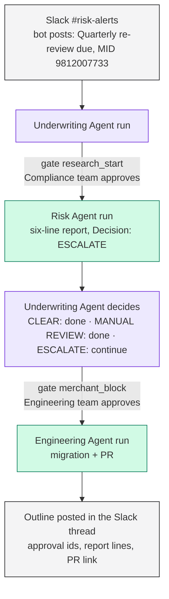

## What you will have

Three roster agents on three templates. A quarterly re-review alert posted by a bot into `#risk-alerts` starts the Underwriting Agent. It asks a human for permission, hands the merchant to the Risk Agent, reads the six-line research report back, and decides from the report's `Decision` line. On `ESCALATE` it asks a second human and hands the block to the Engineering Agent, which opens a pull request. Every run of every agent is team-visible, attributed to the right agent, and graded against that agent's rubric. The Underwriting Agent never researches or acts itself.

## The agent spec

| Part | Underwriting Agent (orchestrator) | Risk Agent (researcher) | Engineering Agent (actor) |
|---|---|---|---|
| Job | Parse the alert, delegate research, decide from the report, delegate the block on `ESCALATE`, post a fixed outline | Produce the six-line re-review report (Merchant, KYC, OFAC, Address, Findings, Decision) for one merchant id | Block one merchant through a database migration in a pull request, never a live change |
| Success | Outline posted with the correct action for the Decision line; approval ids present; no research or action done by itself | Report matches the analyst outcome on seeded merchants; Decision line well formed | Exactly one migration folder and one PR, approval id carried in the SQL comments; refuses without an approval id |
| Tools | None beyond the delegate script | Fixture data in the skill (demo); a KYB provider in production | The repository, GitHub App bot identity |
| How | Template context with the orchestration procedure; `delegate-to-agent` skill; gate hook | `merchant-rereview-research` skill | `block-merchant-migration` skill |
| Trigger | Slack, `#risk-alerts`, bot channel messages enabled | Delegation only | Delegation only |
| Gate | `research_start` before the Risk handoff (Compliance team), `merchant_block` before the Engineering handoff (Engineering team) | None; it never delegates | Requires a `Runtime approval <id>` in its prompt |

The mechanism (script, hook, attribution comment, dashboard card) is described once in [Delegate work to another agent](/guides/recipes/delegate-to-another-agent). This page applies it.



## Order of work for a multi-agent system

Build from the leaves up. Each subagent is a complete agent in its own right and goes through the six steps alone first. The orchestrator comes last, and the gates come after the orchestrator has proven one full hop without them.

1. Risk Agent: job, rubric, template, skill, prove on seeded merchants.
2. Engineering Agent: same, prove it opens a PR from a prompt that carries an approval id.
3. Underwriting Agent: job, rubric, template with the delegate skill and orchestration context, Slack trigger on a test channel.
4. Prove one hop end to end with the gate hook absent.
5. Add the gate hook and prove the same hop with a human approving.

## 1. Define the job

Follow [Define the job](/build/define-the-job) three times.

<Steps>
  <Step title="Risk Agent">
    **Description**: "Produces the merchant re-review research report for one merchant id. Never takes action on a merchant."

    **System instructions** (excerpt): "You are the Risk Agent, the merchant re-review researcher. You run one script, return its report verbatim, and stop. You never invent facts outside the fixtures, never call vendors, and never take action on a merchant. You never run `runtm-api session create`, `launch` or `prompt`."

    Default template `risk-agent`, coding agent `claude-code`.
    {/* cli: runtm-api agents create --name "Risk Agent" --description "Produces the merchant re-review research report for one merchant id. Never takes action on a merchant." --instructions "$(cat risk-instructions.md)" */}
  </Step>
  <Step title="Engineering Agent">
    **Description**: "Blocks a merchant on the payments fork through a Diesel migration and a pull request. Never merges, never pushes to main."

    **System instructions** (excerpt): "You block merchants only through a migration in a PR that a human merges. The decision to block was made by a human; there is an approval id in the prompt. Missing merchant id or approval id: reply `Cannot block: missing <field>` and stop. Do not guess."

    Default template `hyperswitch` (a fork of the payments codebase), coding agent `claude-code`.
    {/* cli: runtm-api agents create --name "Engineering Agent" --description "Blocks a merchant on the payments fork through a Diesel migration and a pull request. Never merges." --instructions "$(cat engineering-instructions.md)" */}
  </Step>
  <Step title="Underwriting Agent">
    **Description**: "Dispatches quarterly merchant re-reviews: delegates research to the Risk Agent, decides from the report, delegates a block to the Engineering Agent only on escalation. Never researches or acts itself."

    **System instructions** (excerpt): "Alerts arrive in `#risk-alerts` from the Risk Monitor bot. Treat every top-level bot alert as a case. You dispatch and decide; two human gates protect this run, enforced by a hook; treat every gate outcome as final."

    Default template `underwriting-agent`, coding agent `claude-code`.
    {/* cli: runtm-api agents create --name "Underwriting Agent" --description "Dispatches quarterly merchant re-reviews to the Risk and Engineering agents behind two approval gates. Never researches or acts itself." --instructions "$(cat underwriting-instructions.md)" */}
    {/* cli-verify: runtm-api agents list */}
  </Step>
</Steps>

## 2. Measure success

Follow [Measure success](/build/measure-success). Each agent is graded on its own runs, because each delegated session is created with that agent's `agent_id`.

| Agent | Category | Success criteria (excerpt) |
|---|---|---|
| Risk Agent | `merchant-rereview` | Six lines in fixed order, Decision is one of `CLEAR`, `ESCALATE`, `MANUAL REVIEW` with a reason, and the Decision matches the analyst outcome for the seeded merchant. No line outside the report. |
| Engineering Agent | `merchant-block` | Exactly one migration folder with `up.sql` and `down.sql`, one PR on branch `block/<MID>`, the approval id in the SQL comments and the PR title. Refused when the prompt has no approval id. |
| Underwriting Agent | `rereview-dispatch` | Outline posted in the exact format; Action line matches the Decision (none, manual review, block approved with PR, or block rejected with reason); both approval ids present when a block happened; no research performed in the run. |

{/* cli: runtm-api agents update <risk_agent_id> --evaluator-criteria "$(cat risk-rubric.json)" */}
{/* cli: runtm-api agents update <engineering_agent_id> --evaluator-criteria "$(cat engineering-rubric.json)" */}
{/* cli: runtm-api agents update <underwriting_agent_id> --evaluator-criteria "$(cat underwriting-rubric.json)" */}

## 3. Give it tools

Follow [Give it tools](/build/give-it-tools). Three templates, one per agent, each carrying only that agent's skill.

<Steps>
  <Step title="Three templates">
    `risk-agent` and `underwriting-agent` are blank environments; they exist to carry skills, context and hooks. `hyperswitch` clones the payments fork so the Engineering Agent can commit a migration. Templates are not only for coding agents: two of the three clone nothing.
    {/* cli: runtm-api template create --display-name "Risk Agent" --github-repo <owner>/<repo> */}
    {/* cli: runtm-api template create --display-name "Engineering Agent" --github-repo <owner>/hyperswitch --github-branch main */}
    {/* cli: runtm-api template create --display-name "Underwriting Agent" --github-repo <owner>/<repo> */}
  </Step>
  <Step title="Git identity for the actor">
    Delegated sessions are team-visible, so the Engineering Agent's commits and PR are attributed to the org's GitHub App bot rather than to whichever person's key launched the parent. Install the GitHub App on the fork under **Settings > Integrations > GitHub**.
    {/* cli-verify: runtm-api github installations */}
  </Step>
  <Step title="Production data">
    In production the Risk Agent's skill would require a KYB provider (see [Add a KYB provider](/guides/recipes/add-kyb-provider)) with an agent-scoped connection so usage is attributed to the Risk Agent. The demo ships fixture merchants inside the skill instead and never calls a vendor.
  </Step>
</Steps>

## 4. Define how it works

Follow [Define how it works](/build/how-it-works/overview).

<Steps>
  <Step title="Subagent skills">
    `merchant-rereview-research` on the Risk template: run one script for the merchant id, return the six-line report verbatim, `Decision` is `CLEAR`, `ESCALATE - <reason>` or `MANUAL REVIEW - <reason>`. Never soften the report; the orchestrator copies it line by line. Never run `runtm-api session create|launch|prompt`.

    `block-merchant-migration` on the Engineering template: extract `MID`, `REASON`, `APPROVAL_ID` (the uuid after "Runtime approval" that the delegate script appends) and `APPROVED_BY` from the prompt; missing merchant id or approval id means `Cannot block: missing <field>` and stop. Generate `migrations/<timestamp>_block_merchant_<MID>/{up.sql,down.sql}` creating a `merchant_blocklist` table row with the reason and approval id, open the PR on `block/<MID>` with `runtm-api session git <session_id> create_branch_and_pr`, reply with `PR: <url>` and the two SQL files. Never force-push, never push to main, never merge.
    {/* cli: runtm-api skills create --name merchant-rereview-research --display-name "Merchant re-review research" --description "Produce the six-line re-review report for a merchant id. Never act on a merchant; never spawn agents." --md ./risk/SKILL.md */}
    {/* cli: runtm-api skills attach <risk_skill_id> --template <risk_template_id> */}
    {/* cli: runtm-api skills create --name block-merchant-migration --display-name "Block merchant via migration" --description "Block a merchant through a Diesel migration and one PR; requires a Runtime approval id in the prompt." --md ./engineering/SKILL.md */}
    {/* cli: runtm-api skills attach <engineering_skill_id> --template <engineering_template_id> */}
  </Step>
  <Step title="The delegate skill on the orchestrator">
    Attach `delegate-to-agent` from the [recipe](/guides/recipes/delegate-to-another-agent) to the Underwriting template, with two targets: `risk` (Risk template, Risk agent, gate `research_start`) and `engineering` (Engineering template, Engineering agent, gate `merchant_block`).
    {/* cli: runtm-api skills attach <delegate_skill_id> --template <underwriting_template_id> */}
  </Step>
  <Step title="The orchestrator context">
    Set the Underwriting template's context to the procedure. This is the part the model reads every run, so it carries the exact two-line commands and the exact reply format.

    ````markdown
    # Context for the Underwriting Agent, merchant re-review orchestrator

    You are triggered by a "Quarterly underwriting re-review due" alert in Slack #risk-alerts.
    You dispatch and decide; you never research or act on a merchant yourself. Two human
    gates protect this run, enforced by a hook; treat every gate outcome as final.

    ## 1. Parse the alert
    Extract: MID (10 digits), merchant name and store number, city/state, last-reviewed date,
    links. No MID: reply asking for it and stop.

    ## 2. Research (gate 1, Risk Agent)
    One Bash call with timeout 600000. Both lines are mandatory.
    ```bash
    # runtm-api session create --template-id <risk_template_id> --agent-id <risk_agent_id>   # "Risk Agent" (via delegate.sh)
    bash ~/.claude/skills/delegate-to-agent/scripts/delegate.sh --target risk \
      --prompt "I'm delegating the work to you for: <the alert, one line>"
    ```
    The hook opens approval research_start for Compliance and holds the call. Allowed: the
    script prints `approval: <id> ...` then the six-line report. Keep the approval id.
    Denied: reply with the hook's reason verbatim and stop.

    ## 3. Decide (policy)
    Read the report's Decision line; do not re-derive it.
    CLEAR: post the outline, no action. MANUAL REVIEW: post the outline with
    "Action: manual review requested". ESCALATE: continue to step 4.

    ## 4. Act (gate 2, Engineering Agent), only on ESCALATE
    ```bash
    # runtm-api session create --template-id <engineering_template_id> --agent-id <engineering_agent_id>   # "Engineering Agent" (via delegate.sh)
    bash ~/.claude/skills/delegate-to-agent/scripts/delegate.sh --target engineering \
      --prompt "I'm delegating the work to you for: Block merchant <MID> (<merchant>). Reason: <Decision reason>."
    ```
    The hook opens approval merchant_block for Engineering. Allowed: the script appends
    "Runtime approval <id>" to the forwarded prompt and Engineering replies with PR: <url>.

    ## 5. Reply, this exact outline, nothing else
    Re-review: <Merchant> #<store> (MID <MID>)
    Research: approved, approval <id>, Risk Agent session <id>
    KYC: / OFAC: / Address: / Findings: / Decision: <lines copied from the report>
    Action: none | manual review requested: <reason> | block approved, approval <id>, PR <url> | block rejected: <reason>

    ## Never
    Never run KYC, OFAC or address checks yourself. Never call runtm-api session create,
    launch or prompt, curl, or any API directly; only delegate.sh. Never retry a denied gate,
    rephrase the command, or split it to avoid the hook. Never act on CLEAR or MANUAL REVIEW.
    ````
    {/* cli: runtm-api template context set <underwriting_template_id> --text "$(cat underwriting-context.md)" */}
    {/* cli-verify: runtm-api template context resolve <underwriting_template_id> */}
  </Step>
  <Step title="The Slack trigger">
    Connect Slack to the Underwriting Agent and enable **Auto-launch on bot channel messages** so alerts posted by the monitoring bot start a run; keep thread follow-ups on so a person can ask questions in the same thread. Point it at a test channel until step 5 passes, then at `#risk-alerts`.
    {/* cli: runtm-api agents create --type slack --name "Underwriting Agent" --agent-id <underwriting_agent_id> */}
    {/* cli: runtm-api agents update <slack_integration_id> --type slack --config '{"triggers":{"new_bot_channel_message":true,"new_thread_message":true,"new_channel_message":false,"new_dm_message":true}}' */}
  </Step>
  <Step title="Build all three templates once">
    {/* cli: runtm-api template build <risk_template_id> */}
    {/* cli: runtm-api template build <engineering_template_id> */}
    {/* cli: runtm-api template build <underwriting_template_id> */}
    {/* cli-verify: runtm-api template get <underwriting_template_id> | jq '{skills: [.skills[].name], stale: .attachments_changed_since_build}' */}
  </Step>
</Steps>

## 5. Prove it works

Follow [Prove it works and iterate](/build/launch-and-iterate), leaves first.

| Case | Input | Expected | Why |
|---|---|---|---|
| Risk alone, clear merchant | Prompt the Risk Agent with MID `9812004471` | Six lines, `Decision: CLEAR`, graded pass | Proves the researcher before any orchestration |
| Risk alone, escalating merchant | MID `9812007733` | `Decision: ESCALATE - <reason>`, graded pass | The escalation path exists |
| Engineering alone, with approval | "Block merchant 9812007733. Reason: test. Runtime approval 00000000-0000-4000-8000-000000000000 (merchant_block, approved by test)" | One migration, one PR on `block/9812007733`, graded pass | The actor works when given an approval id |
| Engineering alone, no approval | Same prompt without the approval sentence | `Cannot block: missing approval id`, graded pass | The actor fails closed |
| Full hop, no hook yet | Bot-style alert for `9812004471` in the test channel | Underwriting posts the outline with `Action: none`; a Risk Agent run appears in Team mode with the delegation card in the parent's transcript | The wiring works before any gate |

Run the children directly from their templates (`session create` then `session prompt`), and the parent through its Slack test channel. Read each run's grade and the scorecard per agent.

{/* cli: runtm-api session create --template-id <risk_template_id> --agent claude-code */}
{/* cli: runtm-api session prompt <session_id> "Quarterly underwriting re-review due: MID 9812004471" */}
{/* cli-verify: runtm-api session grade <session_id> */}
{/* cli-verify: runtm-api agents scorecard --days 7 */}

In the parent's run the transcript shows a "Delegated work to subagent: Risk Agent" card with **Open subagent session**. The Sessions page in Team mode lists the child as a Risk Agent run with its own cost.

## 6. Add guardrails and approvals

Follow [Add guardrails and approvals](/build/guardrails-and-approvals). For a multi-agent system the gates are the guardrail, and they go on the orchestrator's template.

<Steps>
  <Step title="Add the gate hook to the Underwriting template">
    The `hil-gates` hook from the [recipe](/guides/recipes/delegate-to-another-agent), with two rows: `--target risk` opens `research_start` for the Compliance team, `--target engineering` opens `merchant_block` for the Engineering team. Any raw `runtm-api session create|launch|prompt` or direct call to the sessions API is gated as `agent_handoff` for org admins, so the orchestrator cannot route around the script. `PreToolUse`, matcher `Bash`, timeout 600.
    {/* cli: runtm-api template guardrails create <underwriting_template_id> --type hook --name hil-gates --content "$(python3 -c 'import json;print(json.dumps({"event":"PreToolUse","type":"command","matcher":"Bash","timeout":600,"script":open("hil-gates.sh").read()}))')" */}
    {/* cli: runtm-api template build <underwriting_template_id> */}
    {/* cli-verify: runtm-api template guardrails resolve <underwriting_template_id> */}
  </Step>
  <Step title="Deny writes on the actor">
    On the Engineering template, deny `git push --force*` and `git push*main*`, and deny `gh pr merge*`. The skill already says never; the rules make it impossible.
    {/* cli: runtm-api guardrails rules create --name deny-force-push --kind deny --pattern "git push --force*" --purpose "Reviewable changes only" */}
    {/* cli: runtm-api guardrails rules create --name deny-pr-merge --kind deny --pattern "gh pr merge*" --purpose "Humans merge" */}
    {/* cli: runtm-api guardrails rules attach <rule_id> --template <engineering_template_id> */}
  </Step>
  <Step title="Prove the gated hop">
    Post the escalating alert in the test channel. The parent's session flips to `awaiting_approval` with kind `research_start`; a Compliance member approves on the Sessions board. The Risk run completes, the parent reads `ESCALATE`, and a second approval `merchant_block` appears for Engineering. Approve it; the Engineering run opens the PR and the parent posts the outline with both approval ids and the PR link. Then reject one gate on a fresh alert and confirm the parent stops with the hook's reason.
    {/* cli: runtm-api session approvals list <parent_session_id> */}
    {/* cli: runtm-api session approvals resolve <parent_session_id> <approval_id> --approve --note "Research approved" */}
  </Step>
  <Step title="Move the trigger to the live channel">
    Point the Slack trigger at `#risk-alerts`.
  </Step>
</Steps>

## What stays human

- Both handoffs. Nothing reaches the Risk Agent without Compliance saying yes, nothing reaches the Engineering Agent without Engineering saying yes.
- The merge. The Engineering Agent produces a PR; a person merges and deploys.
- The MANUAL REVIEW branch. The orchestrator posts and stops; a person picks it up.

## Gotchas

- **Build leaves first.** An orchestrator is impossible to debug when its subagents are unproven. Grade each child alone before the first hop.
- **Two templates plus one hook, not one template.** If the parent and a child shared a template, the child would inherit the gate hook and the delegate skill, and could delegate again. Separate templates keep the hook on the orchestrator only.
- **Each hop is its own graded run.** The parent's scorecard says whether it dispatched correctly; the child's says whether the research or the block was right. Do not try to grade the whole chain from the parent's rubric.
- **Run-as identity comes from `agent_id` on create**, which is why the script uses the API and not the CLI's `session create`. Without it the child run is attributed to no agent and graded against nothing.
- **The approval id travels in the prompt.** The Engineering Agent refuses without it. The delegate script appends it for action targets; the report from a research target does not need it.
- **Bot messages need the bot toggle.** A monitoring bot posting into the channel does not start a run unless **Auto-launch on bot channel messages** is on.
- **Slack shows the outline, not the ids.** Keep approval and session ids out of the Slack-facing summary when a person reads it; the dashboard shows who approved.

<CardGroup cols={2}>
  <Card title="Delegate work to another agent" icon="share-nodes" href="/guides/recipes/delegate-to-another-agent">
    The script, the hook and the attribution comment, reusable for any chain of roles.
  </Card>
  <Card title="Merchant underwriting agent" icon="building-columns" href="/guides/payments/underwriting-agent">
    The single-agent underwriting example this chain extends.
  </Card>
  <Card title="Payment support agent" icon="headset" href="/guides/payments/support-agent">
    The same delegation pattern fits support escalation: Support Agent to Payment Operations Agent behind one gate.
  </Card>
  <Card title="Build an agent" icon="hammer" href="/build/overview">
    The six steps each agent in the chain goes through.
  </Card>
</CardGroup>
