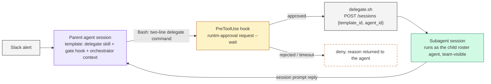

## Outcome

A parent agent can say "hand this to the Risk Agent" and Runtime does the rest: a human approves the handoff, a new session starts on the Risk Agent's template attributed to the Risk Agent, the prompt is forwarded, the reply comes back into the parent's run, and the dashboard shows a "Delegated work to subagent" card linking to the child session. Every hop is graded against its own agent's rubric.

## How it works

There is no "delegate" primitive in Runtime. Delegation is composed from four things you already have, and that is what makes it reproducible:

| Piece | What it is | Where it lives |
|---|---|---|
| Subagent | A roster agent with its own template, skills, rubric and instructions. It does one job and never delegates further. | Agents, Templates |
| `delegate-to-agent` skill | A runbook plus one script. The script calls `POST /api/cloud/sessions` with `template_id` and `agent_id`, waits for `running`, makes the session team-visible, forwards the prompt with `runtm-api session prompt`, and prints the reply. | Skill attached to the parent's template |
| Gate hook | A `PreToolUse` command hook (matcher `Bash`) on the parent's template. It recognises a delegation command, opens an approval with `runtm-approval request --wait`, and returns `allow` or `deny`. | Parent template, Guardrails > Hooks |
| Attribution comment | The first line of every delegation command: `# runtm-api session create --template-id <t> --agent-id <a>   # "<Agent>" (via delegate.sh)`. The dashboard parses it to draw the card; the hook denies a call without it. | The runbook text |

The sandbox already has what the script needs: `RUNTM_API_URL` and a session-scoped `RUNTM_API_KEY` that mirrors the launching user's role, so a member's session can create sessions. The script below posts the create call with `curl` because it reads the raw response; `runtm-api session create --template-id <t> --agent-id <a>` does the same thing in one line if you don't need the body. See [Trigger a subagent](/cloud-api/patterns/subagents) for who is allowed to launch what, and for the approval that a caller edge can require.



## Before you start

- Each subagent exists as a roster agent with a **Default template** that carries its own skill. Build and prove every subagent alone first (see [Prove it works](/build/launch-and-iterate)). A subagent's skill must say it never runs `runtm-api session create|launch|prompt`.
- The parent has its own template. Its skill and context describe when to delegate and what to do with the reply.
- The team ids for approvers, if you gate by team. Org admins and owners can always resolve; `--required-team <id>` narrows it.
- Template ids and roster agent ids for every target: `runtm-api template list`, `runtm-api agents list`.

## Do it

<Steps>
  <Step title="Write the delegate script into a skill">
    Create a skill `delegate-to-agent` with one script at `scripts/delegate.sh`. The table at the top maps a `--target` name to the child's template id, roster agent id, and the approval kind the gate will use. Everything else is generic.

    ```bash
    #!/usr/bin/env bash
    # Runtime agent-to-agent delegation. Creates a session on the target's
    # template, attributed to the target roster agent, waits for it to run,
    # forwards the prompt, prints the reply. Guarded upstream by the gate hook.
    set -uo pipefail

    TARGET=""; PROMPT=""
    while [ $# -gt 0 ]; do
      case "$1" in
        --target) TARGET="$2"; shift 2 ;;
        --prompt) PROMPT="$2"; shift 2 ;;
        *) echo "delegate.sh: unknown argument $1" >&2; exit 2 ;;
      esac
    done
    [ -n "$TARGET" ] && [ -n "$PROMPT" ] || { echo "usage: delegate.sh --target <name> --prompt TEXT" >&2; exit 2; }

    # One row per subagent: template id, roster agent id, approval kind.
    case "$TARGET" in
      risk)        TEMPLATE_ID=<risk_template_id>;        AGENT_ID=<risk_agent_id>;        GATE_KIND=research_start ;;
      engineering) TEMPLATE_ID=<engineering_template_id>; AGENT_ID=<engineering_agent_id>; GATE_KIND=merchant_block ;;
      *) echo "delegate.sh: unknown target '$TARGET'" >&2; exit 2 ;;
    esac

    # 0) The gate that allowed this call wrote its approval id to a marker file
    #    (a hook's allow reason never reaches the model). Surface it, and for an
    #    action target make sure the subagent receives it in the prompt.
    APPROVAL_ID=""; RESOLUTION=""
    MARKER="/tmp/.hil-gate-$GATE_KIND.json"
    if [ -f "$MARKER" ]; then
      APPROVAL_ID=$(python3 -c 'import json,sys; print(json.load(open(sys.argv[1])).get("approval_id",""))' "$MARKER" 2>/dev/null || true)
      RESOLUTION=$(python3 -c 'import json,sys; print(json.load(open(sys.argv[1])).get("resolution",""))' "$MARKER" 2>/dev/null || true)
    fi
    if [ -n "$APPROVAL_ID" ]; then
      echo "approval: $APPROVAL_ID ($GATE_KIND; ${RESOLUTION:-approved})"
      if [ "$TARGET" = "engineering" ] && ! printf '%s' "$PROMPT" | grep -qiE '[0-9a-f]{8}-[0-9a-f]{4}-[0-9a-f]{4}-[0-9a-f]{4}-[0-9a-f]{12}'; then
        PROMPT="$PROMPT Runtime approval $APPROVAL_ID ($GATE_KIND, ${RESOLUTION:-approved})."
      fi
    else
      echo "approval: none recorded for $GATE_KIND (gate marker missing)"
    fi

    : "${RUNTM_API_URL:?RUNTM_API_URL not set}"; : "${RUNTM_API_KEY:?RUNTM_API_KEY not set}"
    BASE="${RUNTM_API_URL%/}"; case "$BASE" in */cloud) ;; *) BASE="$BASE/cloud" ;; esac

    # 1) Create the session attributed to the target agent.
    BODY=$(python3 -c 'import json,sys; print(json.dumps({"template_id": sys.argv[1], "agent_id": sys.argv[2], "source": "agent-delegation"}))' "$TEMPLATE_ID" "$AGENT_ID")
    RESP=$(curl -sS -X POST "$BASE/sessions" -H "Authorization: Bearer $RUNTM_API_KEY" -H "Content-Type: application/json" -d "$BODY")
    SID=$(printf '%s' "$RESP" | python3 -c 'import json,sys; d=json.load(sys.stdin); print(d.get("id") or "")' 2>/dev/null || true)
    [ -n "$SID" ] || { echo "delegate.sh: session create failed: $(printf '%s' "$RESP" | head -c 300)" >&2; exit 5; }
    echo "subagent session: $SID"

    # 2) Fail closed if the template was not applied (an unknown template id
    #    falls back to a blank session instead of erroring).
    TPL=$(runtm-api session get "$SID" | python3 -c 'import json,sys; d=json.load(sys.stdin); print(d.get("template") or d.get("template_id") or "")' 2>/dev/null || true)
    if [ -z "$TPL" ]; then
      echo "delegate.sh: template not applied to $SID; destroying and aborting" >&2
      runtm-api session destroy "$SID" >/dev/null 2>&1 || true
      exit 4
    fi

    # 3) Delegated sessions are always team-visible: the org sees the run,
    #    the gated team can resolve approvals on it, and the subagent's commits
    #    are attributed to the agent's GitHub App bot, not to a person.
    runtm-api session visibility "$SID" team >/dev/null 2>&1 || true
    VIS=$(runtm-api session get "$SID" | python3 -c 'import json,sys; print(json.load(sys.stdin).get("visibility",""))' 2>/dev/null || true)
    echo "visibility: ${VIS:-unknown}"
    if [ "$VIS" != "team" ]; then
      echo "delegate.sh: could not make $SID team-visible; destroying and aborting" >&2
      runtm-api session destroy "$SID" >/dev/null 2>&1 || true
      exit 6
    fi

    # 4) Wait for the sandbox, up to 2 minutes.
    STATE=""
    for _ in $(seq 1 24); do
      STATE=$(runtm-api session get "$SID" | python3 -c 'import json,sys; print(json.load(sys.stdin).get("state",""))' 2>/dev/null || true)
      [ "$STATE" = "running" ] && break
      sleep 5
    done
    echo "subagent state: $STATE"
    [ "$STATE" = "running" ] || { echo "delegate.sh: $SID did not reach running (state: $STATE)" >&2; exit 3; }

    # 5) Forward the work; print only the subagent's final text.
    echo "--- reply ---"
    runtm-api session prompt "$SID" "$PROMPT" | python3 -c '
    import json, sys
    final = None; deltas = []
    for line in sys.stdin:
        line = line.strip()
        if not line or not line.startswith("{"): continue
        try: ev = json.loads(line)
        except Exception: continue
        data = ev.get("data") if isinstance(ev.get("data"), dict) else ev
        t = str(ev.get("event") or data.get("type") or "")
        text = data.get("content") if isinstance(data.get("content"), str) else data.get("text") if isinstance(data.get("text"), str) else None
        if not text: continue
        if "delta" in t: deltas.append(text)
        else: final = text
    print(final if final else "".join(deltas))
    ' || { echo "delegate.sh: prompt failed" >&2; exit 5; }
    ```

    Exit codes: `0` ok, `2` bad arguments, `3` the subagent never reached running, `4` the template was not applied (nothing was prompted), `5` create or prompt failed, `6` the session could not be made team-visible.

    {/* cli: runtm-api skills create --name delegate-to-agent --display-name "Delegate to agent" --description "Hand work to another Runtime agent through the approval-gated delegate script. Never call session create or prompt directly." --md ./SKILL.md */}
    {/* cli: runtm-api skills upload-file <skill_id> --file ./scripts/delegate.sh --path scripts/delegate.sh */}
    {/* cli: runtm-api skills attach <skill_id> --template <parent_template_id> */}
  </Step>

  <Step title="Write the SKILL.md so the agent always uses the two-line form">
    The runbook's job is to make the command shape non-negotiable. The first line is a comment the dashboard parses for the card; the second line runs the script. Give the agent the exact block per target and tell it to copy it verbatim.

    ````markdown
    ---
    name: delegate-to-agent
    description: Hand work to another Runtime agent through the approval-gated delegate script. Use whenever you must delegate, forward, hand off, or trigger a subagent. Never call runtm-api session create or prompt directly; always use this script.
    ---

    # Delegate to another agent

    The command is always two lines and the first line is mandatory. Copy the block verbatim
    and set the Bash tool timeout to 600000 (the gate can hold the call up to 9 minutes).

    ```bash
    # runtm-api session create --template-id <risk_template_id> --agent-id <risk_agent_id>   # "Risk Agent" (via delegate.sh)
    bash ~/.claude/skills/delegate-to-agent/scripts/delegate.sh --target risk \
      --prompt "I'm delegating the work to you for: <forward prompt>"
    ```

    | `--target` | Runs on template | Attributed to | Gate |
    |---|---|---|---|
    | `risk` | Risk Agent | Risk Agent | `research_start` |
    | `engineering` | Engineering Agent | Engineering Agent | `merchant_block` |

    stdout, in order: `approval: <id> (<kind>; approved by <user>)`, `subagent session: <uuid>`,
    `visibility: team`, `subagent state: running`, `--- reply ---`, then the subagent's final message.

    Rules: the hook decides. If the call is denied, report the reason verbatim and stop; never
    retry with a different command shape. If the approved script exits 3, 4 or 5, run the same
    command once more (the gate remembers its approval for 10 minutes), then stop. Never do the
    delegated work yourself.
    ````
  </Step>

  <Step title="Add the gate hook to the parent's template">
    On the parent template's **Guardrails** tab, add a hook: **Event** `PreToolUse`, **Type** `command`, matcher `Bash`, **Timeout (sec)** `600` (it must outlive the approval wait). The script maps each target to an approval kind and an approver team, denies a delegation command that lacks the attribution comment, remembers an approval for 10 minutes so an infrastructure retry does not re-ask, and gates any raw `runtm-api session create|launch|prompt` or direct call to the sessions API as `agent_handoff` for admins.

    ```bash
    #!/usr/bin/env bash
    # HIL gates (Runtime PreToolUse hook, matcher: Bash) for the parent agent.
    set -u
    payload="$(cat)"
    cmd="$(printf '%s' "$payload" | python3 -c 'import json,sys; d=json.load(sys.stdin); print((d.get("tool_input") or {}).get("command") or "")' 2>/dev/null)"
    emit() {
      reason="$(printf '%s' "$2" | python3 -c 'import json,sys; print(json.dumps(sys.stdin.read()))')"
      printf '{"hookSpecificOutput":{"hookEventName":"PreToolUse","permissionDecision":"%s","permissionDecisionReason":%s}}' "$1" "$reason"; exit 0
    }

    COMPLIANCE_TEAM_ID="${HIL_COMPLIANCE_TEAM_ID:-<compliance_team_id>}"
    ENGINEERING_TEAM_ID="${HIL_ENGINEERING_TEAM_ID:-<engineering_team_id>}"

    # A delegate call without its attribution comment is denied WITHOUT opening an
    # approval, and the reason carries the exact line to prepend.
    case "$cmd" in
      *"delegate.sh"*)
        if ! printf '%s' "$cmd" | grep -q "runtm-api session create --template-id"; then
          target="$(printf '%s' "$cmd" | grep -oE -- '--target[= ]+[a-z-]+' | head -n1 | sed -E 's/--target[= ]+//')"
          case "$target" in
            risk)        line='# runtm-api session create --template-id <risk_template_id> --agent-id <risk_agent_id>   # "Risk Agent" (via delegate.sh)' ;;
            engineering) line='# runtm-api session create --template-id <engineering_template_id> --agent-id <engineering_agent_id>   # "Engineering Agent" (via delegate.sh)' ;;
            *)           line='# runtm-api session create --template-id <template id> --agent-id <agent id>   # "<Agent>" (via delegate.sh)' ;;
          esac
          emit deny "hil-gates: delegation command is missing its attribution comment. Re-run the SAME delegate.sh call as a two-line Bash command whose FIRST line is exactly: ${line}  (no approval was consumed; this is a formatting retry, not a gate denial)"
        fi ;;
    esac

    KIND=""; TEAM=""; WHAT=""
    case "$cmd" in
      *"delegate.sh"*"--target risk"*|*"delegate.sh"*"--target=risk"*)
        KIND=research_start; TEAM="$COMPLIANCE_TEAM_ID"; WHAT="Start merchant research (Risk Agent)" ;;
      *"delegate.sh"*"--target engineering"*|*"delegate.sh"*"--target=engineering"*)
        KIND=merchant_block; TEAM="$ENGINEERING_TEAM_ID"; WHAT="Block the merchant (Engineering Agent opens a migration PR)" ;;
      *"runtm-api session create"*|*"runtm-api session launch"*|*"runtm-api session prompt"*|*"/sessions"*"curl"*|*"curl"*"/sessions"*)
        KIND=agent_handoff; TEAM=""; WHAT="Unscripted agent handoff (not via delegate.sh)" ;;
      *) emit allow "hil-gates: not a delegation command" ;;
    esac

    # Marker: the only channel from the gate to the agent (an allow reason never
    # reaches the model). Reused for 10 minutes so an approved retry does not re-ask.
    marker="/tmp/.hil-gate-$KIND.json"
    if [ -f "$marker" ] && [ $(( $(date +%s) - $(stat -c %Y "$marker" 2>/dev/null || echo 0) )) -lt 600 ]; then
      emit allow "hil-gates: $KIND covered by recent approval $(cat "$marker")"
    fi

    summary="$(printf '%s' "$cmd" | tr '\n' ' ' | head -c 600)"
    if [ -n "$TEAM" ]; then GATE=(--required-team "$TEAM"); else GATE=(--required-role admin); fi
    out="$(runtm-approval request --kind "$KIND" "${GATE[@]}" \
      --message "$WHAT requires approval. Command: ${summary}" --wait --timeout 540 2>&1)"; rc=$?
    approval_id="$(printf '%s' "$out" | grep -oE '[0-9a-f]{8}-[0-9a-f]{4}-[0-9a-f]{4}-[0-9a-f]{4}-[0-9a-f]{12}' | head -n1)"
    resolution="$(printf '%s' "$out" | grep -E '^(approved|rejected) by' | tail -n1)"
    case $rc in
      0) python3 - "$KIND" "$approval_id" "$resolution" > "$marker" <<'PY'
    import json, sys, datetime
    print(json.dumps({"kind": sys.argv[1], "approval_id": sys.argv[2], "resolution": sys.argv[3], "at": datetime.datetime.utcnow().strftime("%Y-%m-%dT%H:%M:%SZ")}))
    PY
         emit allow "hil-gates: $KIND approved -- approval ${approval_id}; ${resolution}" ;;
      4) emit deny "hil-gates: $KIND not resolved within 9 minutes. Do NOT retry; report that the request is still pending approval and stop." ;;
      *) emit deny "hil-gates: $KIND rejected or failed -- ${out}. Do not proceed; report this verbatim and stop." ;;
    esac
    ```

    {/* cli: runtm-api template guardrails create <parent_template_id> --type hook --name hil-gates --content "$(python3 -c 'import json;print(json.dumps({"event":"PreToolUse","type":"command","matcher":"Bash","timeout":600,"script":open("hil-gates.sh").read()}))')" */}
    {/* cli-verify: runtm-api template guardrails resolve <parent_template_id> */}
  </Step>

  <Step title="Tell the parent when to delegate">
    The parent's template context (or its skill) names the trigger it reacts to, the exact two-line command per target, what to do with each reply, and what it never does: research or act itself, call the sessions API directly, retry a denied gate, or split the command to avoid the hook. See the [multi-agent example](/guides/payments/multi-agent-underwriting) for a complete orchestrator context.

    {/* cli: runtm-api template context set <parent_template_id> --text "$(cat underwriting-context.md)" */}
  </Step>

  <Step title="Rebuild the parent template, then prove one hop">
    Attach the skill and the hook, build once, then trigger the parent with a test case and resolve the approval on the Sessions board (or with the CLI). The parent's run shows a "Delegated work to subagent" card with an **Open subagent session** link; the child appears in Team mode as a run of the child agent.

    {/* cli: runtm-api template build <parent_template_id> */}
    {/* cli: runtm-api session approvals list <parent_session_id> */}
    {/* cli: runtm-api session approvals resolve <parent_session_id> <approval_id> --approve --note "Test hop" */}
    {/* cli-verify: runtm-api session search --team-mode --source agent-delegation */}
  </Step>
</Steps>

## What the dashboard shows

The card is drawn from the Bash command text, not from any server-side link. Its parser matches `runtm-api session create|launch|prompt` or `scheduled-agents run-now` in the command, reads `--template-id` and `--agent-id` (or `TEMPLATE_ID=` and `AGENT_ID=` assignments), takes the last `# "Label"` comment on the line with the id as the name hint, and picks the child session id from a `subagent session: <uuid>` line in the output. That is why the attribution comment uses the CLI's syntax even though the script uses `curl`: the comment is for the parser, the `curl` is for the API.

## Verify

- `runtm-api session get <child_id>` shows `template` set, `visibility: team`, and telemetry attributed to the child agent (`agents scorecard` lists the child with a graded run).
- `runtm-api session approvals list <parent_id>` shows one approval per gate with the kind you expect and `resolved_by`.
- The parent's transcript ends with the child's reply pasted into the parent's own output format.
- A bare `delegate.sh` call (no comment line) is denied with the prepend instruction and no approval row is created.

{/* cli-verify: runtm-api session get <child_session_id> | jq '{template, visibility, state}' */}
{/* cli-verify: runtm-api agents scorecard --days 7 */}

## Gotchas

- **An unknown template id creates a blank session instead of failing.** The script checks `template` on the created session and destroys it if empty (exit 4). Keep that check.
- **The hook's timeout must exceed the approval wait.** `--timeout 540` inside a hook with `timeout: 600`. A shorter hook timeout kills the wait and the harness treats it as a failed hook.
- **Allow reasons never reach the model.** Anything the agent must know after an approval (the approval id, who approved) has to travel through the marker file, which is why the script reads it and echoes `approval: ...`.
- **Approvals are resolved on the Sessions board or with the CLI, not in Slack.** Scope `--required-team` to a team that is actually watching, or leave the admin fallback.
- **Children must not delegate.** Put "never run `runtm-api session create|launch|prompt`" in every subagent skill, or you get recursion with no gate.
- **The two-line command is one Bash call.** If the agent runs the comment and the script as two separate tool calls, the hook sees a bare `delegate.sh` and denies it. The denial text says exactly what to prepend, so one retry fixes it.
- **Set the Bash tool timeout.** A gate can hold the call for 9 minutes and the child's prompt streams until it finishes; the runbook tells the agent to use a 600000 ms timeout.

<CardGroup cols={2}>
  <Card title="Multi-agent example: underwriting re-review" icon="sitemap" href="/guides/payments/multi-agent-underwriting">
    Underwriting orchestrator, Risk researcher and Engineering actor with two approval gates, built in the six-step order.
  </Card>
  <Card title="Request an approval from inside a run" icon="hand" href="/guides/recipes/request-approval-from-a-run">
    The runtm-approval helper the gate hook is built on.
  </Card>
</CardGroup>
