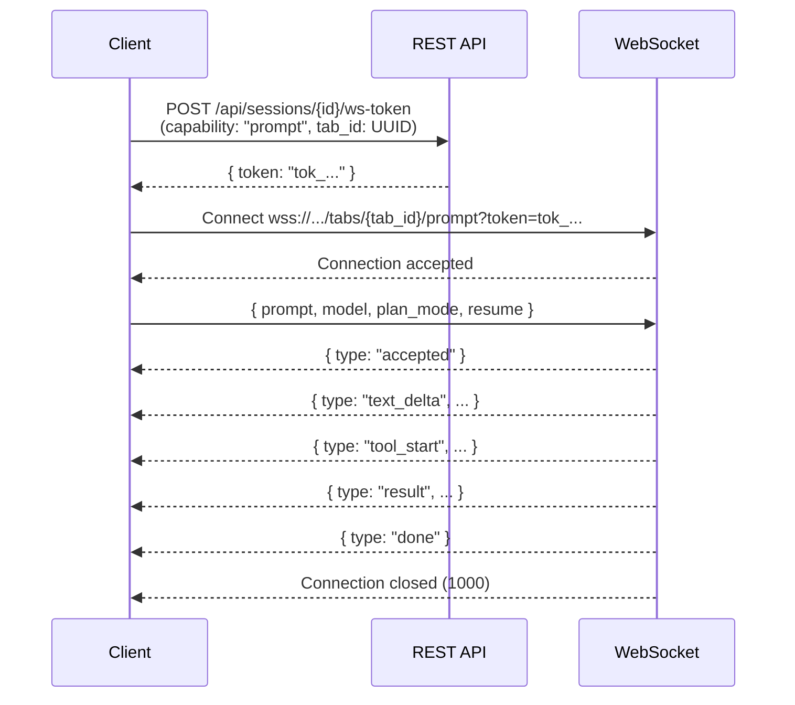

The Prompt WebSocket gives you real-time, bidirectional access to an agent's work - tool calls, file edits, text output, and completion status as they happen. This guide covers the connection flow, event types, and patterns for robust integration.

For the full protocol specification, see the [Prompt WebSocket](/cloud-api/websockets/prompt) reference. For the simpler REST alternative, see [Run Prompt](/cloud-api/sessions/prompt).

## When to use this

- You want live agent output as the prompt executes (not just the final result)
- You are building a UI that displays tool calls, file changes, or streaming text
- You want to monitor an agent's progress in real time from your terminal, a local script, or a backend service

If you only need the final result and do not need streaming, use the REST `POST /api/sessions/{id}/prompt` endpoint with `GET /api/sessions/{id}/events` (SSE) instead.

## Prerequisites

- An API key with `sessions:prompt` scope
- A running session (state: `running`)
- A WebSocket client library (`websockets` for Python, native `WebSocket` for JS/browsers)

## Connection flow

The Prompt WebSocket uses a three-step flow: mint a token, connect, send the prompt.



### Step 1: Mint a token

WebSocket connections cannot carry `Authorization` headers in the browser, so you exchange your API key for a short-lived, single-purpose token over HTTPS:

<CodeGroup>

```python Python
import uuid
import httpx

SESSION_ID = "9f3a3f22-1d4e-4a9a-9a1f-3e5c6b1a0c11"
TAB_ID = str(uuid.uuid4())

resp = httpx.post(
    f"https://app.runtm.com/api/sessions/{SESSION_ID}/ws-token",
    headers={"Authorization": "Bearer runtm_xxx"},
    json={"capability": "prompt", "tab_id": TAB_ID},
)
token = resp.json()["token"]
```

```javascript JavaScript
const SESSION_ID = "9f3a3f22-1d4e-4a9a-9a1f-3e5c6b1a0c11";
const TAB_ID = crypto.randomUUID();

const resp = await fetch(
  `https://app.runtm.com/api/sessions/${SESSION_ID}/ws-token`,
  {
    method: "POST",
    headers: {
      Authorization: "Bearer runtm_xxx",
      "Content-Type": "application/json",
    },
    body: JSON.stringify({ capability: "prompt", tab_id: TAB_ID }),
  },
);
const { token } = await resp.json();
```

</CodeGroup>

<Note>
Tokens are short-lived and single-use. Mint a new one for every WebSocket connection. Never reuse tokens.
</Note>

### Step 2: Connect

Open the WebSocket using the token as a query parameter:

```
wss://app.runtm.com/api/sessions/{SESSION_ID}/tabs/{TAB_ID}/prompt?token={TOKEN}
```

### Step 3: Send the prompt

After the connection is accepted, send exactly one JSON text frame within 10 seconds:

```json
{
  "prompt": "Refactor src/auth into smaller modules",
  "model": "sonnet",
  "plan_mode": false,
  "resume": false
}
```

| Field | Type | Default | Description |
|-------|------|---------|-------------|
| `prompt` | string | required | The prompt text |
| `model` | string | `"sonnet"` | `sonnet`, `opus`, or `haiku` |
| `plan_mode` | boolean | `false` | Read-only plan mode |
| `resume` | boolean | `false` | `true` to continue a prior conversation on the same `tab_id` |

## Event types

After the prompt is accepted, the server streams events until a terminal `done` or `error` frame. Here are the event types in the order you will typically see them:

| Type | Meaning | Key fields |
|------|---------|------------|
| `accepted` | Prompt acknowledged, streaming will begin | `session_id`, `tab_id`, `resume` |
| `status` | Lifecycle update (init, context compaction) | `metadata.subtype` |
| `text_delta` | Partial assistant text | `content` (concatenate to build full message) |
| `tool_start` | Agent invoked a tool | `content` (tool name), `metadata.tool_use_id` |
| `tool_input_delta` | Streaming JSON arguments for the tool call | `content` |
| `tool_end` | Tool call arguments finalized | `metadata.input_json` |
| `tool_result` | Tool execution result | `metadata.is_error` |
| `todo_update` | Agent updated its task list | `metadata.todos` |
| `task_activity` | Subtask lifecycle event | `metadata.task_id`, `metadata.subtype` |
| `result` | Final prompt result | `metadata.cost_usd`, `metadata.usage`, `metadata.num_turns` |
| `done` | Terminal frame - connection will close | (none) |
| `error` | Terminal error frame | `content` (error message) |

## Full example

<CodeGroup>

```python Python
import asyncio
import json
import uuid

import httpx
import websockets

SESSION_ID = "3b1e8e74-7b27-4d87-8b3a-9e4b66a2d1f0"
TAB_ID = str(uuid.uuid4())
API_KEY = "runtm_xxx"

async def stream_prompt():
    async with httpx.AsyncClient() as http:
        resp = await http.post(
            f"https://app.runtm.com/api/sessions/{SESSION_ID}/ws-token",
            headers={"Authorization": f"Bearer {API_KEY}"},
            json={"capability": "prompt", "tab_id": TAB_ID},
        )
        token = resp.json()["token"]

    url = (
        f"wss://app.runtm.com/api/sessions/{SESSION_ID}"
        f"/tabs/{TAB_ID}/prompt?token={token}"
    )

    async with websockets.connect(url) as ws:
        await ws.send(json.dumps({
            "prompt": "Add input validation to the signup form",
            "model": "sonnet",
            "resume": False,
        }))

        async for raw in ws:
            event = json.loads(raw)
            match event["type"]:
                case "text_delta":
                    print(event["content"], end="", flush=True)
                case "tool_start":
                    print(f"\n[tool] {event['content']}")
                case "result":
                    meta = event["metadata"]
                    print(f"\n[done] cost=${meta['cost_usd']:.4f} turns={meta['num_turns']}")
                case "error":
                    print(f"\n[error] {event['content']}")
                case "done":
                    break

asyncio.run(stream_prompt())
```

```javascript JavaScript
const SESSION_ID = "3b1e8e74-7b27-4d87-8b3a-9e4b66a2d1f0";
const TAB_ID = crypto.randomUUID();
const API_KEY = "runtm_xxx";

const tokenResp = await fetch(
  `https://app.runtm.com/api/sessions/${SESSION_ID}/ws-token`,
  {
    method: "POST",
    headers: {
      Authorization: `Bearer ${API_KEY}`,
      "Content-Type": "application/json",
    },
    body: JSON.stringify({ capability: "prompt", tab_id: TAB_ID }),
  },
);
const { token } = await tokenResp.json();

const ws = new WebSocket(
  `wss://app.runtm.com/api/sessions/${SESSION_ID}/tabs/${TAB_ID}/prompt?token=${token}`,
);

ws.addEventListener("open", () => {
  ws.send(JSON.stringify({
    prompt: "Add input validation to the signup form",
    model: "sonnet",
    resume: false,
  }));
});

ws.addEventListener("message", ({ data }) => {
  const event = JSON.parse(data);
  switch (event.type) {
    case "text_delta":
      process.stdout.write(event.content);
      break;
    case "tool_start":
      console.log(`\n[tool] ${event.content}`);
      break;
    case "result":
      console.log(`\n[done] cost=$${event.metadata.cost_usd.toFixed(4)}`);
      break;
    case "error":
      console.error(`\n[error] ${event.content}`);
      break;
    case "done":
      ws.close();
      break;
  }
});
```

</CodeGroup>

## Resume a conversation

To continue a prior conversation on the same tab, reuse the same `tab_id` and set `resume: true`:

```json
{
  "prompt": "Now write tests for the modules you just created",
  "model": "sonnet",
  "resume": true
}
```

You must mint a new token for the same `tab_id` each time you reconnect.

## Close codes

If the connection closes unexpectedly, check the close code:

| Code | Meaning | Action |
|------|---------|--------|
| `1000` | Normal closure after `done` | No action needed |
| `4000` | Prompt frame was missing or malformed | Fix the payload and reconnect |
| `4001` | Token missing, invalid, or expired | Mint a new token and reconnect |
| `4003` | Session not found, access denied, or not running | Check session state, resume if paused |
| `4009` | A prompt is already running | Wait for it to finish or cancel it |

<Warning>
Disconnecting the WebSocket does **not** cancel the agent. The prompt continues running in the background. To stop it, call `POST /api/sessions/{id}/prompt/cancel`. To recover the output, reconnect with `resume: true` or read the [Prompt History](/cloud-api/sessions/history).
</Warning>

## Next steps

<CardGroup cols={2}>
  <Card title="Handle long-running prompts" icon="hourglass" href="/guides/long-running-prompts">
    Cancel, rewind, and replay prompt history.
  </Card>
  <Card title="Manage sessions at scale" icon="cube" href="/guides/managing-sessions-at-scale">
    Lifecycle management, polling, and error recovery.
  </Card>
  <Card title="WebSocket reference" icon="bolt" href="/cloud-api/websockets/overview">
    Terminal, prompt, and collaboration WebSocket specs.
  </Card>
  <Card title="Token Exchange reference" icon="key" href="/cloud-api/websockets/token-exchange">
    Full token-exchange endpoint specification.
  </Card>
</CardGroup>
