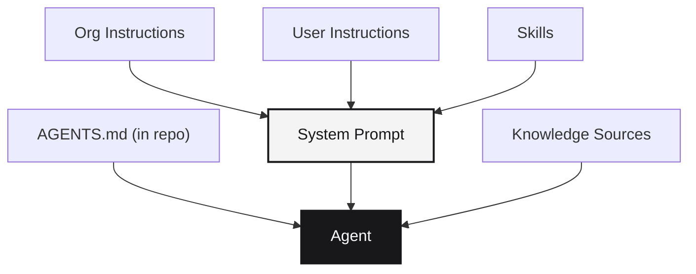

Agents work best when they understand your project's conventions, architecture, and constraints. Runtime provides three layers of context that compose into a single system prompt the agent reads before processing your instructions. This guide explains what each layer does and how to use them effectively.

For the conceptual overview, see [Context](/concepts/context) and [Skills](/concepts/skills).

## The three layers



| Layer | Scope | Set by | Best for |
|-------|-------|--------|----------|
| **Org instructions** | Every session in the org | Admins | Coding standards, security rules, stack constraints |
| **User instructions** | Every session by this user | Individual | Personal preferences, workflow shortcuts |
| **Skills** | Attached per template or session | Admins or authors | Specialized workflows, MCP servers, reference files |
| **AGENTS.md** | Lives in the repository | Anyone with repo access | Project-specific conventions, architecture, commands |
| **Knowledge sources** | Connected per org | Admins | External docs, wikis, runbooks |

When a session boots, Runtime loads org instructions, user instructions, and template instructions into the system prompt. Skills are mounted into the workspace and their MCP servers configured. Knowledge sources become available as agent tools. Then the agent reads `AGENTS.md` from the repo root (if present) as additional context.

## AGENTS.md

`AGENTS.md` is a markdown file in your repository root that teaches the agent about **this specific project**. It is read by every agent that works in the repo — Claude Code, Codex, Cursor, and others all respect it.

### What to include

A good `AGENTS.md` covers:

- **Architecture overview**: where code lives, how services are organized, data flow
- **Development commands**: how to build, test, lint, and run the project
- **Coding conventions**: naming patterns, file organization, preferred libraries
- **Constraints**: things the agent should never do (e.g. "never modify the database schema directly")
- **Common patterns**: how to add a new API route, how to write tests, how to deploy

### Example

```markdown
# AGENTS.md

## Architecture
- FastAPI backend in `backend/app/`
- Next.js frontend in `frontend/`
- Routes are thin — delegate to services in `services/`

## Commands
- `cd backend && pytest -q` — run backend tests
- `cd frontend && npm run lint` — lint frontend
- `cd frontend && npm run dev` — start frontend dev server

## Conventions
- Type hints on all Python functions
- Pydantic models for all request/response shapes
- Structured logging with structlog, never print()
- Routes go in `api/`, business logic in `services/`

## Constraints
- Never modify `runtm.yaml` directly
- Never commit secrets or .env files
- Always run `ruff check` before considering a change done
```

### Tips

- **Keep it concise.** Agents process `AGENTS.md` on every prompt. Long files waste tokens and slow things down. Aim for 50-200 lines.
- **Be explicit about "don'ts".** Constraints ("never do X") are often more valuable than instructions ("always do Y") because they prevent costly mistakes.
- **Update it as the project evolves.** Treat `AGENTS.md` like documentation — it rots if you do not maintain it.
- **Commit it to the repo.** `AGENTS.md` should live alongside the code it describes so every agent (and every team member) sees the same version.

## Org instructions

Org instructions are markdown documents that apply to **every session in the organization**. They are set by admins in the dashboard or via the API.

Use org instructions for rules that apply across all projects:

- Security policies: "Never log API keys or secrets"
- Stack constraints: "We use TypeScript, not JavaScript"
- Quality standards: "All changes must include tests"
- Workflow rules: "Create a PR instead of pushing to main"

### Setting org instructions via the API

<CodeGroup>

```python Python
import requests

headers = {
    "Authorization": "Bearer runtm_xxx",
    "X-Organization-Id": "org_abc123",
}

requests.put(
    "https://app.runtm.com/api/organizations/org_abc123/instructions",
    headers=headers,
    json={
        "instructions": "# Engineering Standards\n\n- Use TypeScript for all new code\n- All functions must have type annotations\n- Never commit secrets to the repository\n- Run lint and tests before marking work as done"
    },
)
```

```javascript JavaScript
await fetch(
  "https://app.runtm.com/api/organizations/org_abc123/instructions",
  {
    method: "PUT",
    headers: {
      Authorization: "Bearer runtm_xxx",
      "X-Organization-Id": "org_abc123",
      "Content-Type": "application/json",
    },
    body: JSON.stringify({
      instructions: "# Engineering Standards\n\n- Use TypeScript for all new code\n- All functions must have type annotations\n- Never commit secrets to the repository\n- Run lint and tests before marking work as done",
    }),
  },
);
```

</CodeGroup>

See [Org Instructions](/cloud-api/context/org-instructions) for the full API reference.

## User instructions

User instructions are personal preferences that apply to **every session you create**. They layer on top of org instructions.

Use them for individual preferences:

- "Use 2-space indentation in all files"
- "Prefer composition over inheritance"
- "When in doubt, write more tests"

### Setting user instructions via the API

```bash
curl -X PUT "https://app.runtm.com/api/instructions" \
  -H "Authorization: Bearer runtm_xxx" \
  -H "Content-Type: application/json" \
  -d '{"instructions": "- Use 2-space indentation\n- Prefer functional patterns over classes"}'
```

See [User Instructions](/cloud-api/context/user-instructions) for the full API reference.

## Skills

Skills are versioned instruction bundles that extend what agents can do. Unlike instructions (which are plain text), skills can include:

- A `SKILL.md` instruction document
- Reference files (code samples, schemas, examples)
- MCP server configurations the agent can call
- Required tooling that gets installed in the sandbox

Skills are managed at the org level and attached to templates or sessions. They are ideal for specialized workflows that only apply to certain types of work.

### Example use cases

| Skill | What it teaches |
|-------|----------------|
| `stripe-integration` | How to add Stripe payments with idempotency keys and webhook verification |
| `deploy-checklist` | Pre-deploy validation steps, health check patterns, rollback procedures |
| `api-review` | Code review standards for API endpoints (auth, validation, error handling) |
| `database-migration` | How to write and test Alembic migrations safely |

Skills are managed through the [Skills API](/cloud-api/context/skills/list) or the dashboard under **Context > Skills**.

See [Skills](/concepts/skills) for the full skill format and authoring guide.

## How the layers compose

When a session starts, context is assembled in this order:

1. **Org instructions** load first — these are the broadest, most stable rules
2. **User instructions** append — these add personal preferences
3. **Template instructions** merge in (if the session was created from a template)
4. **Skills** are mounted into the workspace and their MCP servers configured
5. **Knowledge sources** become available as agent tools
6. The agent reads **AGENTS.md** from the repo root (if present)

The agent sees all of this as a unified system prompt and tool catalog. There is no explicit precedence — later layers add to earlier ones. If they conflict, the agent uses its judgment, but in practice conflicts are rare because each layer serves a different scope.

### Best practices for layering

- **Org instructions**: small, stable, universal. If it applies to every project, it goes here.
- **User instructions**: personal, brief. Style preferences and individual workflow shortcuts.
- **Skills**: specialized, reusable. If guidance only applies to certain work (Stripe, deploys, migrations), make it a skill.
- **AGENTS.md**: project-specific. Architecture, commands, and constraints for this repo.
- **Knowledge sources**: external, dynamic. Docs and runbooks that change frequently.

## Next steps

<CardGroup cols={2}>
  <Card title="Context" icon="brain" href="/concepts/context">
    Conceptual overview of how instructions, skills, and knowledge compose.
  </Card>
  <Card title="Skills" icon="scroll" href="/concepts/skills">
    Full skill format, SKILL.md structure, and authoring guide.
  </Card>
  <Card title="Best practices" icon="shield" href="/guides/best-practices">
    Key hygiene, lifecycle management, and cost controls.
  </Card>
  <Card title="Org Instructions API" icon="file-lines" href="/cloud-api/context/org-instructions">
    Read and update org-wide instructions via the API.
  </Card>
</CardGroup>
