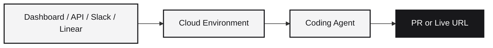

Runtime is the control plane for AI coding agents. Spin up sandboxed cloud environments where Claude Code, Codex, Gemini CLI, and other agents can build, test, and deploy software, with the guardrails, observability, and team workflows you need to use them safely at scale.

## Two ways to use Runtime

<Tabs>
  <Tab title="Runtime Cloud (Hosted)">
    The hosted platform at [app.runtm.com](https://app.runtm.com). Sign up, create an API key, and start building. No infrastructure to manage.

    - Mission control dashboard with live previews, terminals, and real-time collaboration
    - Full REST API and WebSockets for sessions, agents, deploys, templates, and integrations
    - Organizations with role-based access, scoped API keys, and team-wide guardrails
    - Managed integrations for GitHub, Linear, Slack, and knowledge sources
    - Session-level visibility into every prompt, tool call, file change, and deploy

    **This is what most of this documentation covers.**
  </Tab>
  <Tab title="Open Source (Self-Hosted)">
    The [open-source core](https://github.com/runtm-ai/runtm) you can run on your own infrastructure. Deploy with Docker Compose and bring your own cloud provider.

    - CLI for local sandbox management and deployments
    - Open-source deployment API for programmatic access to builds and logs
    - Full control over compute, networking, and data residency

    See the [Open Source](/open-source/overview) tab for CLI, self-hosting, and OSS API docs.
  </Tab>
</Tabs>

## What you can do

- **Let your whole team build safely** - PMs, designers, marketers, and ops teams can prompt agents without git knowledge. You set the guardrails, they get one-click PRs and deploys.
- **Run agents end-to-end** - sessions clone repos, install dependencies, run tests, and ship to live URLs without leaving the platform.
- **Trigger from where you work** - launch agent sessions from Slack messages, Linear tickets, or GitHub issues. The agent picks up the task and reports back.
- **Standardize with templates** - snapshot a fully-configured environment once, then let teammates spin up new sessions in seconds.
- **Govern at the org level** - set instructions every agent follows, control which commands need approval, restrict deployments, and audit every action.
- **See what every agent is doing** - track prompts, tool calls, file changes, costs, and deploys per user, per session, per day.

## How it works



1. **Create a session** from the dashboard, API, or an integration trigger
2. The session boots an isolated cloud environment, optionally from a [template](/concepts/templates) snapshot
3. Org [context](/concepts/context) (instructions, skills, knowledge) and [guardrails](/concepts/guardrails) are applied automatically
4. The [agent](/concepts/agents) writes code, runs tests, commits, and can deploy to a live URL
5. Every step is logged, observable, and auditable

## Core concepts

<CardGroup cols={2}>
  <Card title="Sessions" icon="cube" href="/concepts/sessions">
    Isolated cloud environments where agents write and run code. One VM per session, full filesystem, terminal, and live preview.
  </Card>
  <Card title="Agents" icon="robot" href="/concepts/agents">
    Background autonomous coding sessions. Fire-and-forget tasks that pick up tickets, write PRs, and report back.
  </Card>
  <Card title="Templates" icon="sparkles" href="/concepts/templates">
    Snapshots of environments. Pre-configure the stack, secrets, instructions, and skills so new sessions start instantly.
  </Card>
  <Card title="Context" icon="brain" href="/concepts/context">
    System instructions, skills, and knowledge sources that agents bring into every session.
  </Card>
  <Card title="Skills" icon="scroll" href="/concepts/skills">
    Reusable instruction bundles with files, MCP servers, and tooling. The unit of agent extension.
  </Card>
  <Card title="Guardrails" icon="shield" href="/concepts/guardrails">
    Policies, allowlists, and hooks that govern what agents can run, deploy, and access.
  </Card>
  <Card title="Deployments" icon="rocket" href="/concepts/deployments">
    Ship a session's work to a live HTTPS URL with build logs, previews, and rollback.
  </Card>
  <Card title="Integrations" icon="plug" href="/concepts/integrations">
    Connect GitHub, Linear, Slack, and knowledge sources to trigger sessions and authorize agents.
  </Card>
  <Card title="Organizations" icon="users" href="/concepts/organizations">
    Team workspaces with roles, scoped API keys, and shared resources.
  </Card>
  <Card title="Observability" icon="chart-line" href="/concepts/observability">
    Activity logs, metrics, and traces for every prompt, tool call, and deploy.
  </Card>
  <Card title="Real-time" icon="bolt" href="/concepts/real-time">
    WebSockets for interactive terminals, streaming prompt output, and multi-user presence.
  </Card>
</CardGroup>

## Quick start

<Steps>
  <Step title="Create an API key">
    Sign in at [app.runtm.com](https://app.runtm.com), open **Settings > API Keys**, and click **Create key**. Copy the secret immediately.
  </Step>

  <Step title="Verify the key">
    ```bash
    curl https://app.runtm.com/auth/verify \
      -H "Authorization: Bearer runtm_xxx"
    ```
  </Step>

  <Step title="Create a session">
    ```bash
    curl -X POST https://app.runtm.com/api/sessions \
      -H "Authorization: Bearer runtm_xxx" \
      -H "Content-Type: application/json" \
      -d '{"name": "my-first-session"}'
    ```
  </Step>
</Steps>

See the full [Quick Start](/quickstart) for a complete walkthrough with code samples in Python and JavaScript.

## Base URL

All API endpoints use:

```
https://app.runtm.com/api
```

Authenticate every request with `Authorization: Bearer runtm_xxx`. See [Authentication](/cloud-api/authentication) for details on API keys, scopes, and organization context.

## Common use cases

<CardGroup cols={2}>
  <Card title="Agent automation" icon="robot" href="/guides/managing-sessions-at-scale">
    Create sessions, send prompts, and collect output programmatically from scripts, CI pipelines, or internal tools.
  </Card>
  <Card title="Cost monitoring" icon="chart-line" href="/guides/pulling-activity-and-telemetry">
    Track session usage, prompt costs, and team activity across your organization.
  </Card>
  <Card title="Context and governance" icon="brain" href="/guides/teach-the-agent-your-codebase">
    Teach agents your codebase with AGENTS.md, skills, and org-wide instructions.
  </Card>
  <Card title="Real-time streaming" icon="bolt" href="/guides/streaming-prompts-over-websockets">
    Stream agent output over WebSockets for live UIs and dashboards.
  </Card>
</CardGroup>

See the full [Guides](/guides/overview) for all patterns and best practices.

## Works with your favorite agents

Runtime is agent-agnostic. The same session can run Claude Code, Codex, Gemini CLI, OpenCode, or any CLI-based coding agent. Switch between them, run several side by side, or pick the right one for the task.
