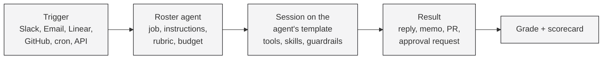

Runtime is where operations teams create and run AI agents. A payments support team gives an agent the job of reconstructing a disputed charge, a risk team gives one the job of assembling a fraud review packet, an onboarding team gives one the job of preparing an underwriting memo. Each agent has a defined job, a measurable success criterion, scoped access to the team's tools, a runbook for how it works, and an approval gate in front of anything consequential.

Agents run inside isolated cloud sandboxes, so a mistake stays contained, and every run is recorded end to end: the prompt, the tool calls, the cost, the result, and the grade.

## What an agent is made of

Every agent in Runtime is built in six steps, and the order matters: make it capable first, prove it on real cases with read-only access, then lock it down. The dashboard, the CLI and these docs all follow the same order.

| # | Question | Runtime objects |
|---|----------|-----------------|
| 1 | What is the job? | A **roster agent**: name, description, system instructions, a default template and a default coding agent (the harness that runs it). |
| 2 | How is success measured? | **Evaluation categories** on the agent (when a run belongs to a category, how to grade it pass or fail, what a human would have spent), a **monthly budget**, and the **scorecard** that aggregates grades and spend. |
| 3 | What can it reach? | A **template**: the environment the agent runs in, carrying tool providers (Zendesk, Datadog, BigQuery, or your own), MCP servers, secrets and repositories. |
| 4 | How does it work? | **Skills** (runbooks the agent follows), **instructions** layered from org to session, and **triggers** (Slack, Linear, GitHub, Email, WhatsApp, SMS, a cron schedule, or the API). |
| 5 | Does it work? | Run seeded cases on demand with read-only credentials, read the grade, adjust the rubric or the runbook, and watch the scorecard move. No guardrails yet. |
| 6 | Now lock it down | **Guardrails** (command allowlists, hooks, network rules) written from what the passing runs actually did, and **approvals** the agent requests before anything consequential. |

<CardGroup cols={2}>
  <Card title="Quickstart: build your first agent" icon="rocket" href="/quickstart">
    Ten minutes from a blank org to a graded run.
  </Card>
  <Card title="Build an agent" icon="hammer" href="/build/overview">
    The six steps, one page each, with the dashboard steps and the CLI behind them.
  </Card>
  <Card title="Guides" icon="book-open" href="/guides/overview">
    Worked agents for payments operations: support, fraud and risk review, merchant underwriting.
  </Card>
  <Card title="API Reference" icon="code" href="/cloud-api/overview">
    Every endpoint, plus the `runtm-api` CLI that wraps them.
  </Card>
</CardGroup>

## How a run happens



1. A trigger fires: someone mentions the agent in Slack, an email lands in its inbox, a Linear issue is assigned to it, or a cron tick arrives.
2. Runtime launches a session on the agent's default template, with the agent's instructions layered on top of the org's and the template's.
3. The agent works the case using the tools and skills the template carries. Once guardrails are in place, anything they mark as sensitive either prompts, is denied, or waits for a human approval.
4. The result goes back where the trigger came from: a thread reply, an email, a Linear comment, a PR.
5. The grader scores the run against the agent's evaluation categories, and the scorecard updates.

## Hosted or self-hosted

<Tabs>
  <Tab title="Runtime Cloud">
    The hosted platform at [app.runtm.com](https://app.runtm.com). Agents, templates, triggers, guardrails, grading and the scorecard all live here. This is what the Documentation, Guides and API Reference tabs describe.
  </Tab>
  <Tab title="Open Source">
    The [open source runtime](https://github.com/runtm-ai/runtm) covers self-hosted deployments of the apps your agents produce: the `runtm` CLI, the deployment API and the templates. See the [Open Source](/open-source/overview) tab.
  </Tab>
</Tabs>

## Programmatic access

Everything the dashboard does is also an API call. Create an API key in **Settings > API Keys**, then call the Cloud API at:

```
https://app.runtm.com/api/cloud
```

The `runtm-api` CLI wraps the whole surface and is what coding agents use when they build or operate other agents. Install it with `curl -fsSL https://runtm.com/install | bash`, set `RUNTM_API_KEY`, and see the [Agent CLI](/cloud-api/agent-cli) reference. Throughout Build and Guides, every dashboard step has its CLI equivalent alongside it.
